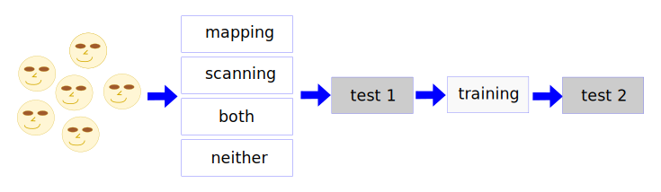

```{r setup, include=FALSE}
knitr::opts_chunk$set(echo = TRUE, warning = FALSE)
```

## Введение

Дисперсионный анализ (analysis of variance, ANOVA) позволяет установить отличия между средними значениями нескольких генеральных совокупностей. В данном примере дисперсионный анализ применяется для сравнения эффективности различных методов анализа текстов, которым обучали студентов Carmel College (Аукленд, Новая Зеландия) в рамках программы развития исследовательских навыков.

На рисунке показана схема проведения эксперимента.



Все студенты были разделены на 4 группы. В первой группе их обучали методу картирования понятий в тексте с помощью диаграмм. Во второй группе перед подробным изучением текста студентов просили ознакомиться с его структурой путем беглого чтения (сканирования) заголовков и вводных разделов. В третьей группе одновременно использовались оба этих метода. Четвертая группа была контрольной, ни один из этих методов анализа не применялся. Обучение проводилось в течение 6 недель. Перед началом программы и по ее окончании студенты проходили тесты на понимание текста (Gapadol Reading Comprehension Test), который дает оценку возраста (степени зрелости) читателя. 

В файле `reading.txt` содержатся данные об изменении результатов теста после обучения для каждого студента. Положительное число означает улучшение результатов, отрицательное - ухудшение. Также указана принадлежность студента к одной из экспериментальных групп.

Данные взяты из Wild C.J., Seber A.F. Chance Encounters. A First Course in Data Analysis and Inference, Wiley, 2000. - p. 435.

## Подготовка

```{r Загрузка пакетов}
suppressMessages(library(readr)) # считывание данных из текстовых файлов
suppressMessages(library(tidyverse)) # манипулирование данными
suppressMessages(library(ggplot2)) # визуализация
suppressMessages(library(scales)) # Процентный формат для осей графиков
```

Данные сохранены в "плоском" табличном формате. Разделителями столбцов являются табуляции. Десятичный разделитель - точка.

Первая строка содержит заголовки столбцов. Для считывания данных из текстового файла можно воспользоваться либо встроенными функциями: `read.table()`, `read.csv()` (в этом семействе несколько функций для разных форматов), либо аналогичными функциями из пакета `readr`. Функции из пакета `readr` работают быстрее и в сложных случаях дают больше возможностей для настройки формата данных. Изучить их подробнее можно в разделе [Data Import](http://r4ds.had.co.nz/data-import.html) книги R for Data Science.


```{r Загрузка данных}
reading <- read_tsv('data/reading.txt')
```

```{r Структура данных}
glimpse(reading)
```

Для управления порядком вывода групп при анализе создадим факторную переменную.

```{r Создание фактора}
reading <- reading %>% 
  mutate(methodf = factor(method, 
                            levels = c('Neither', 'Scan', 'Map', 'Both')))
```

## Разведочный анализ

Сравним изменение результатов теста в разных группах.

```{r Сравнение распределений выходных показателей}

# На графике
ggplot(data = reading, aes(y = increase, x = methodf, colour = method)) +
  geom_point()  +
  labs(title = 'Reading comprehension improvement', x = NULL, y = NULL) +
  stat_summary(fun.data = 'mean_cl_normal', geom = 'crossbar') +
  geom_hline(aes(yintercept = mean(increase)), color = 'red', linetype = 'dashed')

# В табличном виде
reading %>% 
  group_by(methodf) %>% 
  summarise(mean_increase = round(mean(increase), 2))

```

Точки показывают распределение результатов отдельных студентов в каждой группе. Ящики показывают среднее улучшение результатов теста в каждой группе и 95% доверительный интервал. Горизонтальная линия - среднее улучшение для всех студентов, вместе взятых.

По графику видно, что все методы дают улучшение по сравнению с контрольной группой, однако различие между методами минимальное. 

## Проверка статистических гипотез

### Существует ли различие между группами?

В нашем распоряжении - 4 независимые выборки (наблюдения в одной выборке никак не связаны с наблюдениями в другой выборке), поэтому необходимо применять однофакторный дисперсионный анализ (One-Way ANOVA). Фактором является группа (метод анализа текста), а зависимой переменной - улучшение результатов в тесте на понимание текста.

Совокупностями в данном случае будут все студенты с аналогичными испытуемым характеристиками, которые будут обучаться соответствующим методом.

**Нулевая гипотеза:** *Среднее улучшение во всех группах одинаково* (нет отличий между эффективностью методов).

**Альтернативная гипотеза:** *Среднее улучшение отличается по крайней мере для двух групп* (есть отличия между эффективностью методов).

Для проверки гипотезы используется тестовая статистика:

$$F = MS_{B} / MS_{W},$$

где $MS_{B}$ и $MS_{W}$ - соответственно **межгрупповая дисперсия** (вычисляется на основе групповых средних и общего среднего) и **внутригрупповая дисперсия** (вычисляется на как средневзвешенное оценок дисперсии в отдельных группах). При истинности $H_0$ не должно быть разницы между средними групп, т.е. $MS_{B} = 0$ и $F = 0$. 

Для применения дисперсионного анализа в R есть встроенная функция: `aov()`.

```{r ANOVA в R}
reading_anova <- aov(increase ~ methodf, data = reading)
summary(reading_anova)
```


В этом примере использована запись критерия в виде **формулы**:  запись `increase ~ methodf` означает: *Улучшение в зависимости от группы*. 

Левая часть формулы (до тильды) содержит зависимую переменную (`increase`), а правая часть - факторы, влияющие на эту переменную (`methodf`).

В таблице дисперсионного анализа указаны суммы квадратов (Sum Sq) и дисперсия (Mean Sq) - межгрупповые, т.е. объясненные влиянием фактора (methodf) и внутригрупповые (Residuals), а также степени свободы. Наблюдаемое значение F-статистики критерия - $F = 4.445$. Уровень значимости $p = 0.008 < 0.05$. 

Низкая вероятность получения наблюдаемого отношения межгрупповой и внутригрупповой дисперсии позволяет отвергнуть нулевую гипотезу в пользу альтернативной. Среднее улучшение результатов теста по крайней мере в двух группах отличается.

### В каких группах результаты теста отличаются?

Для того, чтобы выяснить, в каких именно группах отличаются результаты теста, необходимо применить одну из процедур множественных сравнений (post-hoc tests, multiple comparisons). Процедуры множественных сравнений, в отличие от t-критериев, содержат поправки, позволяющие снизить вероятность ошибки I рода (нуль-гипотеза отвергнута ошибочно, ложноположительных исход).

**Метод Тьюки (Tukey Honestly Significant Distance, Tukey HSD)** реализован встроенной функцией `TukeyHSD()`.

```{r Множественные сравнения методом Тьюки}
options(digits = 3)
TukeyHSD(reading_anova)
```

p-значения и доверительные интервалы скорректированы (увеличены) таким образом, чтобы общая вероятность получить ошибку I рода в результате всех сравнений была 5%.

Статистически значимые отличия от контрольной группы наблюдаются только для метода картирования и сочетания методов. Различия в эффективности методов анализа текста статистически не значимы.

Для сравнения, рассчитаем p-значения без поправки на множественные сравнения. 

Функция `with()` не обязательна, но она позволяет использовать имена столбцов в наборе данных напрямую, т.е. не писать `reading$increase`.

```{r Множественные сравнения без поправки}
with(reading, 
     pairwise.t.test(increase, methodf, 
                     p.adjust.method = 'none')
     )
```

Результаты множественных сравнений без поправки использовать нельзя, т.к. велика вероятность ложноположительного исхода.

Существует несколько процедур множественных сравнений, отличающихся по степени консервативности. Наиболее консервативной считается **процедура Бонферрони**, в которой при проведении $m$ попарных сравнений каждое из p-значений умножается на $m$. 

```{r Множественные сравнения с поправкой Бонферрони}
with(reading, 
     pairwise.t.test(increase, methodf, 
                     p.adjust.method = 'bonferroni')
     )
```

Здесь, как и в методе Тьюки, значимы только отличия метода картирования и сочетания методов от контрольной группы.

Для визуализации результатов множественных сравнений можно воспользоваться встроенной функцией `plot()`.

```{r Визуализация доверительных интервалов}
reading_mcomp <- TukeyHSD(reading_anova)
reading_mcomp
plot(reading_mcomp)
```

На графике показаны 95% доверительные интервалы для разности средних в каждой паре сравниваемых групп. Только интервалы для пар Map-Neither и Both-Neither не включают 0, поэтому различия в этих группах являются статистически значимыми.

Для визуализации различий средствами `ggplot2` необходимо преобразовать результат сравнения в датафрейм. Для этого можно воспользоваться пакетом `broom`.

```{r Преобразование в датафрейм}
reading_mcomp_df <- broom::tidy(reading_mcomp)
reading_mcomp_df
```

```{r Визуализация доверительных интервалов с помощью ggplot}
ggplot(data = reading_mcomp_df, aes(x = comparison)) +
  geom_errorbar(aes(y = estimate, 
                    ymin = conf.low, 
                    ymax = conf.high,
                    color = adj.p.value > 0.05)) +
  geom_hline(yintercept = 0, color = 'red', linetype = 'dashed') +
  labs(x = NULL, y = NULL, 
       title = '95% доверительный интервал\nдля среднего улучшения результатов теста') +
  coord_flip()
```
