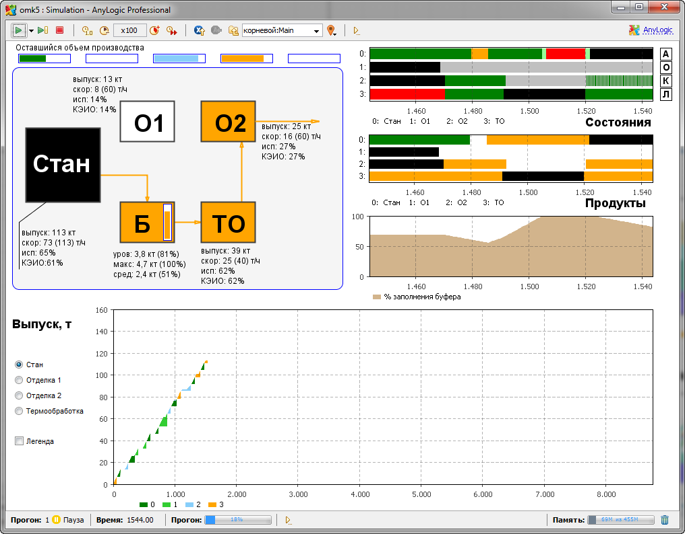

```{r Настройка, include=TRUE}
knitr::opts_chunk$set(dev = 'png', warning = FALSE) 
# выбор формата для графиков и отключение жалоб на русские шрифты на графиках
options(digits = 4) # Количество значащих цифр при выводе
suppressMessages(library(readr))
suppressMessages(library(tidyverse))
suppressMessages(library(ggplot2))
```

## Постановка задачи


**Общая эффективность оборудования** (OEE — Overall Equipment Effectiveness) – это показатель, который отражает степень эффективности использования оборудования. Он позволяет выяснить, насколько используется потенциал оборудования в реальной работе и помогает выяснить причины потерь, снижающих эффективность.
Для расчета ОЕЕ необходимо перемножить следующие показатели: **производительность**, **готовность оборудования** и **качество**. 

Эти показатели рассчитываются следующим образом:

- **Готовность** = Машинное время / Чистое рабочее время

- **Производительность** = Текущая выработка / Запланированная выработка

- **Качество** = Количество качественных изделий / Текущая выработка

Произведение этих элементов умножают на 100, чтобы получить результат в процентах:

ОЕЕ = Готовность x Производительность x Качество х 100

На рисунке показано, как различные потери снижают общую эффективность оборудования.


В этом задании вы исследуете, как различные правила диспетчеризации заказов влияют на коэффициент общей эффективности прокатного стана на производстве стальных труб. Данные получены методом имитационного моделирования производства.


На рисунке показана схема производственных участков.


В цехе расположены несколько производственных участков - прокатный стан, два участка отделки (О1 и О2), участок термообработки (ТО) и буферный склад. 

Цех выпускает 4 вида продукции:

 - черные трубы (без отделки и термообработки, сразу после сварки на стане)
 - трубы с отделкой (например, нанесение покрытия или нарезка резьбы)
 - трубы с термообработкой (термообработка улучшает качество, снижая остаточные напряжения в металле)
 - трубы с отделкой и термообработкой

Завод получает от клиентов заказы, а планировщики и диспетчер цеха определяют какими партиями и в какой последовательности надо запускать заказы в производство.

При необходимости отделки или термообработки продукция с прокатного стана поступает на соответствующие участки. Возможно ограниченное количество конфигураций материальных потоков в цехе: 

- стан работает на выход (производство черных труб) - в этом случае производиельность составляет 120 тонн/час;
- стан работает на два участка отделки (производятся трубы с отделкой, термообработка не нужна) - в этом случае производительность такая же, т.к. производительность каждого из участков отделки - 60 тонн/час;
- стан работает на участок термообработки (показана на рисунке выше) - в этом случае до заполнения буфера производительность стана максимальна, но после заполнения скорость должна быть снижена до 40 тонн/час, т.к. участок термообработки не может переработать больше.

Возможны и другие конфигурации, однако все они приводят к падению производительности по сравнению с первыми двумя вариантами.

На рисунке показана диаграмма Гантта, отражающая загруженность и режимы работы различных производственных участков. Видно, что значительную часть времени стан работает со сниженной производительностью (светло-зеленая заливка на верхнем графике) или блокирован (красная заливка). В то же время, участки отделки часто простаивают, т.к. один из них приходится отключать, когда поток продукции со стана идет через термообработку.


Для выпуска каждого типа продукции требуется определенная конфигурация оборудования. Для перехода между конфигурациями нужны переналадки. За счет изменения правил диспетчеризации (т.е. правил определения порядка выпуска продукции) можно сократить время простоев и периоды работы стана со сниженной производительностью из-за узких мест на последующих участках. На рисунке показана визуализация распределений показателя OEE для различных участков при использовании различных правил диспетчеризации заказов.


В файле `data/dispatching.txt` содержатся сохраненные из имитационной модели значения показателя - коэффициент общей эффективности использования стана (`MillOEE`) для нескольких прогонов модели. Использованная в каждом прогоне стратегия запуска заказов указана в столбце `Mode`.


Требуется:

- Провести разведочный анализ данных, в котором сравнить форму распределения показателя OEE для стана при различных правилах запуска заказа, а также средние значения с для показателя OEE с учетом 95% доверительного интервала
- Доказать статистическую значимость наблюдаемых отличий с помощью дисперсионного анализа и процедуры множественных сравнений Тьюки.

# Здесь ваше решение

...

# Как сдавать

Результатом вашей работы является отчет в формате HTML, полученный с помощью кнопки Knit из данного файла.

Отредактируйте тег `author:` в начале этого документа, указав свою фамилию (фамилии) и группу.

Решения присылайте на мой email.
