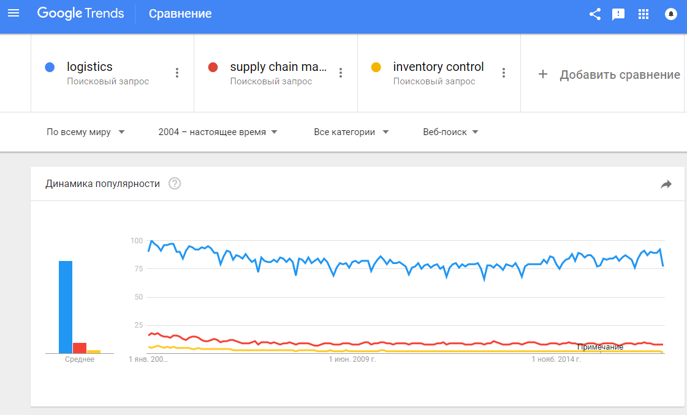
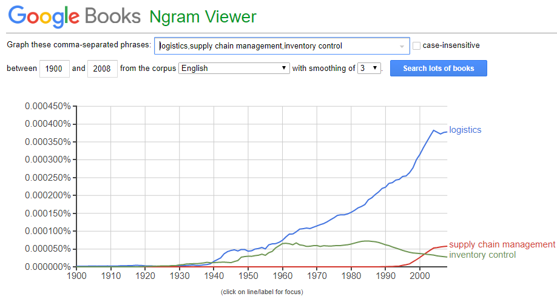
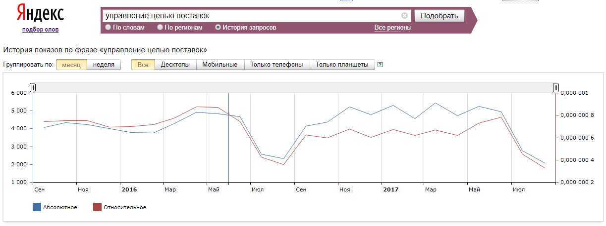
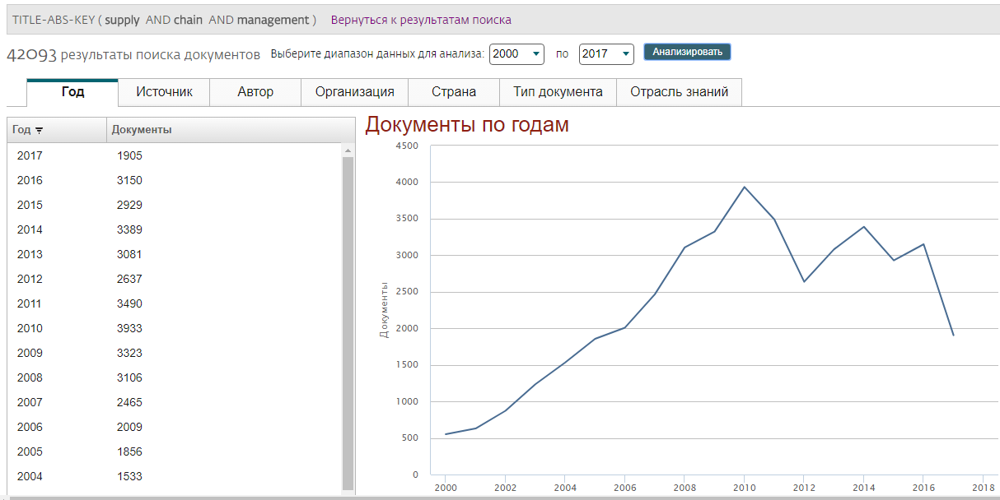

# Анализ трендов

## Задание

 - Изучите материалы урока 1 в [MOOC](http://bit.ly/r-mooc).

 - Познакомьтесь с работой онлайн-сервисов для анализа трендов:

1. [Google Trends](https://trends.google.com) - анализ трендов поисковых запросов

2. [Google Books Ngram Viewer](https://books.google.com/ngrams) - анализ частоты упоминания слов в книгах

3. [Yandex Wordstat](https://wordstat.yandex.ru) - анализ истории поисковых запросов

4. Базы данных научного цитирования **Scopus** - анализ динамики публикаций по заданной тематике. Эти базы данных можно открыть на странице [электронных ресурсов библиотеки ВШЭ](https://library.hse.ru/e-resources), доступ с компьютеров в вышке, или из дома, если у вас есть [пароль](https://elib.hse.ru/e-resources/ez/ezregulation.htm)

 - Используя один или несколько сервисов, проведите мини-исследование трендов на любую интересующую вас тематику. 

 - Опишите цели и результаты своего исследования в документе R markdown. Ориентируйтесь в объем порядка 500-700 слов. Документ должен иметь структуру (заголовки), по крайней мере одну веб-ссылку (URL) и по крайней мере одну картинку. Не забудьте указать авторов и название исследования. Язык отчета - русский или английский, по желанию.
 
 - Преобразуйте свой отчет в формат HTML и отправьте в форум курса в LMS, тема: **Trend Analysis Reports**.
 
 
 Вы найдете полезными следующие ресурсы:
 
 - [Шпаргалка по R Markdown](https://rawgit.com/postlogist/research-seminar/master/r-bootcamp/markdown.html)
 - [Пример анализа трендов в Google Trends](https://freshit.net/chto-predprinimatel-mozhet-uznat-v-google-trends/)
