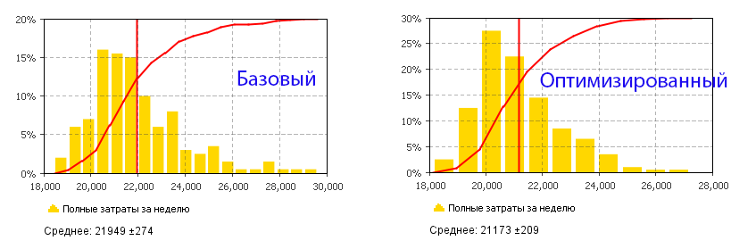

```{r setup, include=FALSE}
knitr::opts_chunk$set(echo = TRUE, warning = FALSE)
```

## Введение

[Имитационное моделирование](http://www.anylogic.ru/case-studies) - это мощный инструмент анализа и улучшения процессов и систем. Имитационная модель - это компьютерная программа, которая передает наиболее важные для принятия решения аспекты поведения изучаемой системы. После разработки такой модели и проверки ее на адекватность, аналитик может изменять входные параметры модели, так чтобы добиться желаемого результата. Поскольку в имитационном моделировании практически всегда используются стохастические факторы, наблюдаемые выходные показатели модели также являются не константами, а случайными величинами. Распределения этих случайных величин и числовые характеристики данных распределений представляют интерес для аналитика. Сравнивая, как изменяются эти распределения при изменении входных параметров, аналитик принимает решение о том, какое сочетание параметров является наилучшим. Для обработки результатов имитационного эксперимента необходимо применять методы статистики.

В этом примере мы сравним два сценария (варианта организации бизнес-процессов в контакт-центре).  Сценарии отличаются количеством операторов, работающих в часы пиковой нагрузки. Для сравнения сценариев используется показатель совокупных затрат в неделю. 

На графике показаны распределения еженедельных затрат для базового и оптимизированного сценариев, полученные при многократном повторении (репликации) модельного эксперимента.



В базовом сценарии контакт-центр работает с текущей численностью операторов. В оптимизированном сценарии добавлено несколько операторов для обработки входящих звонков. Значения параметров подбирались с помощью оптимизатора OptQuest.

Можно видеть, что средние затраты для оптимизированного сценария примерно на 780 у.е. ниже, чем базовом сценарии. Но также можно видеть, что распределения  значений затрат в различных репликациях довольно широкие и их области перекрываются. Чтобы доказать статистическую значимость (не случайность) результатов необходимо применить подходящий статистический метод. Для сравнения средних двух совокупностей можно применить двухвыборочный t-критерий.


**Примечание:** графики и наборы данных для анализа в этом примере были получены в разных прогонах модельного эксперимента, поэтому числовые характеристики будут немного отличаться. 

## Подготовка

```{r Загрузка пакетов}
suppressMessages(library(readr)) # считывание данных из текстовых файлов
suppressMessages(library(tidyverse)) # манипулирование данными
suppressMessages(library(ggplot2)) # визуализация
suppressMessages(library(scales)) # Процентный формат для осей графиков
```

Результаты эксперимента сохранены в двух файлах, находящихся в папке `data`:
[callcenter_basecase.txt](data/callcenter_basecase.txt) и [callcenter_optimized.txt](data/callcenter_optimized.txt)

Данные сохранены в "плоском" табличном формате. Разделителями столбцов являются табуляции. Десятичный разделитель - точка.
Первая строка содержит заголовки столбцов. Для считывания данных из текстовых файлов можно воспользоваться либо встроенными функциями: `read.table()`, `read.csv()` (в этом семействе несколько функций для разных форматов), либо аналогичными функциями из пакета `readr`. Функции из пакета `readr` работают быстрее и в сложных случаях дают больше возможностей для настройки формата данных. Изучить их подробнее можно в разделе [Data Import](http://r4ds.had.co.nz/data-import.html) книги R for Data Science.


```{r Загрузка данных}
data_basecase <- read_tsv('data/callcenter_basecase.txt')
data_optimized <- read_tsv('data/callcenter_optimized.txt')
```

Файлы содержат параметры: число телефонных линий, а также число дополнительных сотрудников в пиковые часы. Две последние колонки - это еженедельные затраты и доля отклоненных звонков. В файлах содержится соответственно `r nrow(data_basecase)` и `r nrow(data_optimized)` наблюдений.

```{r Структура данных}
glimpse(data_optimized)
```


## Разведочный анализ

Для визуального анализа данных с помощью `ggplot2` удобно слить два набора данных в одну таблицу.

```{r Объединение данных в одну таблицу}
data_merged <- union_all(data_basecase, data_optimized)
```

Сравним распределения затрат и доли отклоненных звонков в двух сценариях.

```{r Сравнение распределений выходных показателей}
# Затраты
ggplot(data = data_merged, aes(y = Cost, x = Scenario, fill = Scenario)) +
  geom_boxplot() +
  labs(title = 'Совокупные затраты в неделю', x = NULL, y = NULL, fill = 'Сценарий')

# Доля отклоненных звонков
ggplot(data = data_merged, aes(y = Rejected, x = Scenario, fill = Scenario)) +
  geom_boxplot() +
  labs(title = 'Доля отклоненных звонков', x = NULL, y = NULL, fill = 'Сценарий') +
  scale_y_continuous(labels = percent)
  

```

На ящичной диаграмме видно, что медианная доля отклоненных звонков в оптимизированном сценарии почти в 3 раза ниже, чем базовом. Затраты отличаются не столь существенно.

Сравним средние значения двух совокупностей с учетом погрешности их оценки. Для этого можно воспользоваться встроенной функциональностью `ggplot2` для построения доверительных интервалов.

```{r Сравнение средних}
ggplot(data = data_merged, aes(x = Scenario, y = Cost, color = Scenario)) +
  stat_summary(fun.data=mean_cl_boot) +
  labs(title = paste('Средние затраты по', 
                nrow(data_basecase), 'наблюдениям' ),
       x = NULL, y = NULL, color = 'Сценарий')

```


Доверительные интервалы не пересекаются. Это означает, что данных достаточно для доказательства различия в средних значениях совокупностей, из которых взяты наши выборки. Подтвердить это различие можно при помощи двухвыборочного t-критерия. 

## Проверка статистических гипотез

В нашем распоряжении - две независимые выборки (наблюдения в одной выборке никак не связаны с наблюдениями в другой выборке), поэтому необходимо применять двухвыборочный t-критерий (paired samples t-test, independent samples t-test). Парный t-критерий (paired t-test) в данном случае не подходит, т.к. наблюдения в выборках никак не связаны.

Наблюдения, которыми мы располагаем, принадлежат одной из двух совокупностей: 
 
 - *Все результаты прогонов модели с исходными параметрами* и 
 - *Все результаты прогонов модели с оптимизированными параметрами*.
 
**Нулевая гипотеза:** *Средние затраты в неделю одинаковы для двух совокупностей* (нет отличий между ними, разность средних равна нулю).
**Альтернативная гипотеза:** *Средние затраты в неделю отличаются для двух совокупностей* (разность средних для двух совокупностей отлична от 0).

Для применения t-критерия в R есть встроенная функция: `t.test()`, которая реализует оба варианта критерия - для парных и для независимых выборок.

```{r t-критерий в R}
result <- t.test(Cost ~ Scenario, data = data_merged)
result
```

В этом примере использована запись критерия в виде **формулы**:  запись `Cost ~ Scenario` означает: *Затраты в зависимости от сценария*. 

Левая часть формулы (до тильды) содержит зависимую переменную (`Cost`), а правая часть - факторы, влияющие на эту переменную (`Scenario`).

Наблюдаемое значение t-статистики критерия - `r round(result$statistic, 2)`. Уровень значимости p очень высокий, $p = `r result$p.value` < .05$. 

Столь низкая вероятность получения наблюдаемого отличия средних позволяет отвергнуть нулевую гипотезу в пользу альтернативной.

Наблюдаемая разность средних: `r round(result$estimate[1]-result$estimate[2])` - не случайна. Она статистически значима. Оптимизированный сценарий позволяет снизить затраты.

В выводе функции `t.test()` также содержится интервальная оценка для разности средних двух совокупностей (`r round(result$conf.int)`).


С практической точки зрения, достигнутое снижение затрат в `r round(result$estimate[1]-result$estimate[2])` долларов позволит компании сэкономить в год около `r round((result$estimate[1]-result$estimate[2])*52/1000)` тысяч долларов. 
