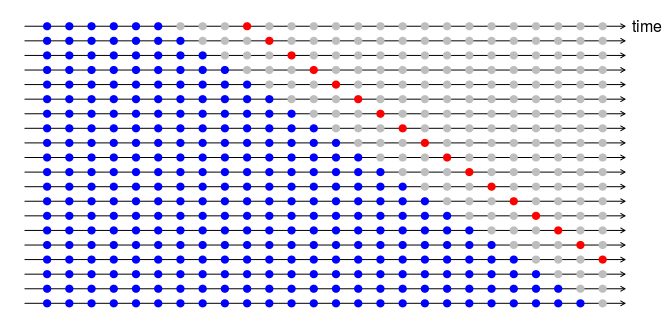

# Введение

Чтобы оценить, насколько эффективно работают методы прогнозирования на определенных данных, применяются **показатели ошибки прогноза**. В этом блокноте рассмотрены несколько групп таких показателей - абсолютные, относительные, сравнительные, которые с различных сторон характеризуют **ошибку прогноза**, т.е. отклонение прогнозируемых и фактических значений. 

Наиболее часто для оценки эффективности прогнозирования используется относительный (процентный) показатель ошибки - MAPE, однако у данного показателя есть ряд недостатков, которые проявляются в случае, когда временной ряд содержит нулевые или очень малые наблюдения. Даже когда нет проблемы нулевых значений, качество прогнозирования сложно оценить лишь с использованием MAPE, поскольку для каждого конкретного объекта прогнозирования действует свой набор факторов (новизна продукта, маркетинговая активность, количество и тип клиентов, степень агрегирования), который определяет пределы точности прогнозирования. Поэтому нельзя ориентироваться на усредненные, "отраслевые" значения ошибки прогнозирования и необходимо сравнивать подходы к прогнозированию в одинаковых условиях. С этой целью будут рассмотрены показатели, основанные на сопоставлении ошибки прогноза применяемого для прогнозирования метода с показателями ошибки простых, "наивных" методов прогнозирования на тех же данных.

Также будут рассмотрены методы оценки качества моделей прогнозирования, основанные на разделении данных на "обучающий" и "тестовый" периоды, а также скользящем контроле.

Материал составлен на основе раздела [3.1](https://www.otexts.org/fpp2/sec-2-methods.html) и [3.4](https://www.otexts.org/fpp2/accuracy.html) книги: *Hyndman R, Athanasopoulos G. Forecasting Principles and Practice*.

```{r Подключение библиотек, warning=FALSE, message=FALSE}
library(tidyverse) # визуализация и трансформация данных
library(forecast) # анализ временных рядов и прогнозирование
library(fpp) # Примеры временных рядов
library(sophisthse) # Загрузка временных рядов из базы Sophist
```

# Простые методы прогнозирования

## Описание

Вначале рассмотрим несколько простых методов прогнозирования, которые могут использоваться как основа для сравнения при бенчмаркинге различных методов прогнозирования.

### Метод усреднения (Average Method)

В этом методе в качестве прогноза на будущие периоды берется среднее значение ряда, вычисленное на всем историческом периоде:

$$ \hat{y}_{T+h} = \frac{1}{T} \sum_{t=1}^{T} y_t $$

Метод также может применяться и для неупорядоченных данных (берется среднее по выборке).

В R для реализации этого метода используется функция: `forecast::meanf(y, h)`, где `y` - временной ряд, а `h` - горизонт прогнозирования.

### Наивный метод (Naïve method)

Наивный прогноз - это простое повторение последнего наблюдения в качестве прогноза на будущие периоды. В R метод реализован двумя функциями: `forecast::naive(y, h)` и `forecast::rwf(y, h)`.

### Сезонный наивный метод (Seasonal naïve method)

Этот метод использует тот же принцип, однако повторяется не последнее наблюдение, а последнее наблюдение для одноименного периода. Например, прогноз на декабрь 2018 года, сделанный в 2017 году, будет равен значению за декабрь 2017 года.

В R этот метод реализован функцией `forecast::snaive(y, h)`

### Метод дрейфа (Drift Method)

Дрейф - это медленное изменение уровня ряда. В методе дрейфа вычисляется средний прирост уровня ряда по всем смежным периодам. Затем это значение используется для прогнозирования будущих значений. 

$$ \hat{y}_{T+h} = y_T + \frac{h}{T-1} \sum_{t=2}^{T} (y_t - y_{t-1})$$

Можно показать, что данное выражение эквивалентно:

$$ \hat{y}_{T+h} = y_T + h  \frac{y_T - y_1}{T-1} $$

Т.е. в методе дрейфа прогнозом является продолжение прямой линии, проведенной через первое и последнее наблюдения.

В R метод дрейфа реализован функцией: `forecast::rwf(y, h, drift=TRUE)`.


## Примеры

```{r Производство пива в Австралии - простые методы}

# Отбор данных
beer2 <- ausbeer %>% 
  window(start = 1992, end = c(2005, 4))

beer_label <- 'Поквартальный прогноз производства пива в Австралии'
beer_unit <- 'млн. л'

# Прогнозирование
beer_m <- meanf(beer2, h = 11) # по среднему значению ряда
beer_n <- naive(beer2, h = 11) # наивный прогноз
beer_sn <- snaive(beer2, h = 11) # сезонный наивный прогноз
beer_d <- rwf(beer2, h = 11, drift = T) # метод дрейфа

```

Для визуализации прогнозов можно воспользоваться функциями `autoplot()` и `autolayer()`:

```{r Визуализация прогнозов}

# Сравнение нескольких прогнозов
autoplot(beer2, series = 'История') +
  autolayer(beer_m, PI = FALSE, series = 'Среднее ряда') +
  autolayer(beer_n, PI = FALSE, series = 'Наивный прогноз') +
  autolayer(beer_sn, PI = FALSE, series = 'С. наивный прогноз') +
  autolayer(beer_d, PI = FALSE, series = 'Метод дрейфа') +
  labs(title = beer_label, x = NULL, color = NULL, y = beer_unit)
  
```


Пакет `forecast` рассчитывает и доверительные интервалы для прогноза, которые легко получить с в виде графика или таблицы. В предыдущем примере мы отключили вывод доверительных интервалов для прогноза с помощью параметра `PI = FALSE`, чтобы не загромождать график. 

```{r Доверительный интервал}

# График
autoplot(beer_sn) + 
  labs(title = beer_label, y = beer_unit, 
       x = NULL, color = NULL)

# Таблица
beer_sn

```


Доверительные интервалы позволяют оценить степень надежности прогноза. Чем шире интервал, тем выше неопределенность.


## Работа с компонентами прогноза

Объект, который возвращают функции для прогнозирования, имеет следующую структуру:

```{r Структура объекта}
names(beer_d)
```

Наиболее полезными компонентами являются `mean` (точечный прогноз), `fitted` (прогноз в историческом периоде) и `residuals` - остатки прогноза. С назначением остальных компонентов можно познакомиться в справке: `?forecast`.

Для выделения прогноза в историческом периоде и остатков удобно использовать функции `fitted()` и `residuals()` соответственно.

```{r Визуализация подогнанных значений и остатков}
# Подогнанные значения
autoplot(beer2, series = 'История') +
  autolayer(fitted(beer_sn), series = 'Прогноз') +
  labs(title = beer_label, y = beer_unit, 
       x = NULL, color = NULL)

# Остатки
autoplot(residuals(beer_sn)) +
labs(title = 'Ошибки прогноза объема производства пива', 
     y = beer_unit, x = NULL, color = NULL)
```

## Пример прогнозирования показателя из ЕАЭСД

Рассчитаем прогноз показателя из ЕАЭСД (sophist): Ввод в действие жилых домов, млн.кв.метров (CONSTR_Y_NAT)

```{r Данные по строительству}

constr <- sophisthse('CONSTR_Y_NAT')

#sophisthse_metadata(constr)

constr_label <- 'Ежегодный ввод в действие жилых домов (CONSTR_Y_NAT)'
constr_unit <- 'млн.кв.м'

# Оставляем данные с 2005 года
constr <- constr %>% 
  window(start = 2005)

# Визуализация
autoplot(constr) +
  labs(title = constr_label, y = constr_unit, x = NULL)

```

Прогнозирование ввода новых жилых домов с помощью рассмотренных методов.

```{r Прогнозирование объема ввода жилых домов}

constr_m <- meanf(constr, h = 10)
constr_n <- naive(constr, h = 10)
constr_d <- rwf(constr, h = 10, drift = T)


autoplot(constr, series = 'История') +
  autolayer(constr_m, PI = FALSE, series = 'Среднее ряда') +
  autolayer(constr_n, PI = FALSE, series = 'Наивный прогноз') +
  autolayer(constr_d, PI = FALSE, series = 'Метод дрейфа') +
  labs(title = constr_label, x = NULL, color = NULL, y = constr_unit)

```

# Оценка точности прогнозирования

## Показатели ошибки прогнозирования

Ошибка прогноза в периоде $t$ - это разность фактических и прогнозных значений:

$$ e_t = y_t -\hat{y}_t $$

Ошибку прогноза можно вычислить для каждого прошедшего периода. Для получения общей картины о точности прогнозирования, применяются **показатели ошибки прогнозирования**, которые вычисляются с помощью агрегирования ошибок за все периоды.

Все показатели ошибки прогнозирования можно разделить на две группы: 

- **абсолютные** - зависят от масштаба пронозируемой величины (**scale-dependent**) и, как правило, измеряются в тех же единицах, что и эта величина;

- **относительные** - представляют собой безразмерные отношения и не зависят от масштаба (**scale-independent**). Показатели этой группы удобно использовать для сравнения точности прогнозирования для разных объектов.

Еще одним критерием для классификации показателей может служить их назначение. Одни показатели характеризуют разброс прогнозных и фактических значений, другие - систематическую ошибку, т.е. смещение прогноза.

### Средняя абсолютная ошибка и стандартная ошибка (MAE и RMSE)

Наиболее популярными абсолютными показателями являются *средняя абсолютная ошибка* (Mean Absolute Error, MAE) и **стандартная ошибка** (Root Mean Squared Error, RMSE):

$$ MAE = mean(|e_t|) $$

$$ RMSE = \sqrt{mean(e_t^2)} $$

Оба показателя позволяют сравнивать точность прогнозирования при работе с одним и тем же рядом. MAE легче вычисляется и интерпретируется, а RMSE применяется для построение доверительных интервалов и расчета страхового запаса.

### Средняя ошибка (ME)

Кроме того, к абсолютным относится еще один показатель - **средняя ошибка** (Mean Error, ME), который позволяет оценить систематическую ошибку (смещение) прогноза:

$$ ME = mean(e_t) $$

### Средняя абсолютная ошибка и средняя ошибка в процентах (MAPE и MPE)

Наиболее популярным относительным показателем является **средняя абсолютная ошибка в процентах** (Mean Absolute Percentage Error, MAPE).  Этот показатель вычисляется путем усреднения **относительных ошибок** прогноза:

$$ p_t = 100 \frac{e_t} {y_t} $$

$$ MAPE = mean(|p_t|) $$


Для оценки систематической ошибки прогноза применяется показатель **средняя ошибка в процентах** (Mean Percentage Error, MPE):

$$ MPE = mean(p_t) $$

Относительные ошибки удобны тем, что с их помощью можно сравнивать точность прогнозирования для разных временных рядов, отличающихся масштабом величин.

Недостатком этих показателей является невозможность их вычисления, если встречаются нулевые значения ряда (например, при прогнозировании спроса на малооборачиваемые или сезонные товары). Величина MAPE получается очень большой, когда фактические значения спроса $y_t < 1$.

MAPE и MPE нельзя применять, когда у показателя нет абсолютного нуля (например, при прогнозировании температуры в шкале Цельсия), поскольку для таких данных не имеет смысла само понятие отношения (деления).

Другим способом нормирования ошибок с целью получения относительных показателей является сопоставление их с абсолютной ошибкой наивного метода (**scaling**). Для несезонных рядов используется деление на среднюю абсолютную ошибку наивного прогноза, для сезонных - используется сезонный наивный прогноз.

### Нормированная ошибка (MASE)

**Нормированная ошибка** (scaled error) для несезонного ряда:

$$ q_j = \frac{e_j} {\frac{1}{T - 1} \sum_{t=2}^T |y_t - y_{t-1}|} $$


Нормированная ошибка для сезонного ряда:

$$ q_j = \frac{e_j} {\frac{1}{T - m} \sum_{t=m+1}^T |y_t - y_{t-m}|} $$

Для неупорядочынных (перекрестных) данных нормированная ошибка вычисляется относительно стандартного отклонения прогнозируемой величины:

$$ q_j = \frac{e_j} {\frac{1}{N} \sum_{i=1}^N |y_i - \bar{y}|} $$


Средняя абсолютная нормированная ошибка (Mean Absolute Scaled Error) вычисляется путем усреднения нормированных ошибок для всех периодов:

$$ MASE = mean(|q_j|) $$


Для вычисления показателей ошибки в R используется функция `forecast::accuracy()`.

## Пример - ошибка прогноза объема производства пива

Ряд сезонный, поэтому наилучший результат среди простых методов должен давать сезонный наивный  прогноз.

```{r Сравнение прогнозов и исторических данных}

# Метод усреднения
autoplot(beer2, series = 'История') +
  autolayer(fitted(beer_m), series = 'Среднее ряда') +
  labs(title = beer_label, x = NULL, color = NULL, y = beer_unit)


# Наивный прогноз
autoplot(beer2, series = 'История') +
  autolayer(fitted(beer_n), series = 'Наивный прогноз') +
  labs(title = beer_label, x = NULL, color = NULL, y = beer_unit)

# Сезонный наивный прогноз
autoplot(beer2, series = 'История') +
  autolayer(fitted(beer_sn), series = 'С. наивный прогноз') +
  labs(title = beer_label, x = NULL, color = NULL, y = beer_unit)

# Метод дрейфа
autoplot(beer2, series = 'История') +
  autolayer(fitted(beer_d), series = 'Метод дрейфа') +
  labs(title = beer_label, x = NULL, color = NULL, y = beer_unit)

```


Показатели ошибки прогноза автоматически рассчитываются функцией `forecast::accuracy()`:

```{r Точность прогноза - один метод}
accuracy(beer_m)
```

Для удобства сравнения прогнозов, объединим результаты по всем прогнозам в одну таблицу:

```{r Расчет ошибок прогнозирования - производство пива}

rbind(accuracy(beer_m),
      accuracy(beer_n),
      accuracy(beer_sn),
      accuracy(beer_d)) %>%
  as_tibble() %>%
  round(2) %>%
  mutate(`Метод` = c('Среднее', 'Наивный', 'С. наивный', 'Дрейф')) %>%
  select(`Метод`, MASE, MAPE, everything()) %>%
  arrange(MASE)

```

Показатель ошибки MASE для сезонного наивного прогноза равен 1, поскольку для сезонного ряда (когда задана частота) именно этот прогноз используется как основа для сравнения. Усреднение в ~2.5 раза хуже по этому показателю, чем сезонный наивный прогноз.

**Примечание:** по умолчанию выводится слишком большое количество значащих цифр. Для упрощения интерпретации показателей можно округлить все значения в таблице с помощью функции `round()`. Обратите внимание, что это надо делать до того, как в таблицу будет добавлен текстовый столбец с названиями методов.


## Прогнозирование Ex-Post

При выборе метода прогнозирования аналитика интересует не то, как эта модель объясняла прошлое, а то, как она предсказывает будущее. Поэтому показатели ошибки, вычисленные на историческом периоде могут вводить в заблуждение. Можно построить такую модель, которая "предсказывает"  уже известное прошлое идеально точно.

Поэтому распространенным приемом для выбора модели является разделение ряда на два периода - **обучающий** (training set) и **тестовый** (test set). При этом модель строится на обучающем периоде, а показатели ошибки вычисляются на тестовом. Этот способ называется **прогнозирование Ex-Post**.


Обычно в качестве тестового множества выбирается порядка 20% наблюдений, однако это ориентировочная величина, которую можно скорректировать исходя из объема имеющихся данных и горизонта прогнозирования. Рекомендуется делать тестовый период как минимум такой же длины, как и горизонт прогнозирования.

В примере о прогнозировании пива модели строились на подмножестве ряда `ausbeer` Для проверки доступно еще 11 ежеквартальных наблюдений.

```{r Тестовый период для производства пива}
autoplot(ausbeer, series = 'Полный ряд') +
  autolayer(beer2, series = 'Сокращенный ряд')
```

Прогнозы в тестовом периоде можно сравнить с фактическими данными визуально.

```{r Визуальное сравнение прогнозов и факта в тестовом периоде}

# Сравнение нескольких прогнозов
autoplot(window(ausbeer, start = 2004), series = 'Факт') +
  autolayer(beer_m, PI = FALSE, series = 'Среднее ряда') +
  autolayer(beer_n, PI = FALSE, series = 'Наивный прогноз') +
  autolayer(beer_sn, PI = FALSE, series = 'С. наивный прогноз') +
  autolayer(beer_d, PI = FALSE, series = 'Метод дрейфа') +
  labs(title = beer_label, x = NULL, color = NULL, y = beer_unit)


```


Функция `accuracy()` автоматически вычисляет показатели ошибки на тестовом периоде, если предоставить данные тестового периода, или просто весь ряд целиком.

```{r Ошибка тестового периода для метода усреднения}
# Метод усреднения
accuracy(beer_m, ausbeer)
```

```{r Ошибка тестового периода для наивного прогноза}
# Наивный прогноз
accuracy(beer_n, ausbeer)
```

```{r Ошибка тестового периода для сезонного наивного прогноза}
# Сезонный наивный прогноз
accuracy(beer_sn, ausbeer)
```

```{r Ошибка тестового периода для метода дрейфа}
# Метод дрейфа
accuracy(beer_d, ausbeer)
```


При использовании тестового периода функция вычисляет еще один показатель - **U-статистику Тейла (Theil's U)**. 

Этот показатель похож на MASE, и в нем используется для нормализации показатель ошибки наивного прогноза. Однако, в отличие от MASE, используются не абсолютные а процентные ошибки.  Поэтому данный показатель страдает от тех же недостатков при малых или нулевых значениях ряда, что и показатели MAPE и MPE.

Суммы квадратов процентных ошибок (Sum of Squared Percent Errors, SSPE) для модели и наивного прогноза вычисляются по формулам:

$$ SSPE(модель) = \sum_{t=2}^N \left(\frac{e_t} {y_{t-1}} \right)^2 $$
      
$$ SSPE(\text{наивный прогноз}) = 
    \sum_{t=1}^N  \left( \frac{y_t - y_{t-1}} {y_{t-1}} \right)^2 $$
      

$$ U= \sqrt{ \frac{SSPE(модель)}{SSPE(\text{наивный прогноз}) }} $$

Интерпретация U-статистики Тейла аналогична интерпретации показателя MASE:

- при $U < 1$ используемый метод работает лучше, чем наивный прогноз;
- при $U >= 1$ не имеет смысла использовать этот метод, т.к. он не лучше, чем наивный прогноз.


### Как сравнить модели по ошибке в тестовом периоде

Чтобы сравнить модели на основе ошибки в тестовом периоде, можно собрать все показатели ошибки в одну таблицу, с которой можно работать, используя функции пакета `dplyr`:

```{r Сравнение ошибок в тестовом периоде}

rbind(accuracy(beer_m, ausbeer)[2,], # ошибки в тестовом периоде - 2 строка
      accuracy(beer_n, ausbeer)[2,],
      accuracy(beer_sn, ausbeer)[2,],
      accuracy(beer_d, ausbeer)[2,]) %>%
  as_tibble() %>%
  round(2) %>%
  mutate(`Метод` = c('Среднее', 'Наивный', 'С. наивный', 'Дрейф')) %>%
  select(`Метод`, MASE, MAPE, everything()) %>%
  arrange(MASE)

```


## Метод скользящего контроля (cross-validation)

Более сложный и полезный метод оценки качества прогноза основан на **скользящем контроле** (*cross-validation*, или *rolling forecasting origin*). При этом в качестве обучающего периода используются $n$ начальных наблюдений, а в качестве тестового - одно наблюдение, отстоящее от обучающего периода на величину горизонта прогнозирования ($n + h$). Значение $n$ постепенно увеличивается, насколько позволяют данные. Ошибки прогноза на $h$ шагов вперед усредняются.
Принцип работы метода показан на рисунке:



В это примере горизонт прогноза $h = 4$. Синие точки - обучающий период, красные - тестовый.

В R скользящий контроль реализован в функции `forecast::tsCV()`. Эта функция возвращает ошибки прогноза на горизонте $h$ для каждого периода. 

```{r Ошибка прогноза на горизонте 4 квартала}
beer3 <- ausbeer %>% window(start = 2003)
tsCV(beer3, meanf, h = 4)
```

Для агрегирования ошибок можно использовать любой общепринятый показатель, например стандартную ошибку, RMSE. Для удобства, создадим функцию, вычисляющую этот показатель.

```{r Стандартная ошибка прогноза на горизонте 4 квартала}

RMSE <- function(errors) {
  errors^2 %>% mean(na.rm = T) %>% sqrt()
}

# Усреднение
beer3 %>% tsCV(meanf, h = 4) %>% RMSE() %>% round(1)

# Наивный прогноз
beer3 %>% tsCV(naive, h = 4) %>% RMSE() %>% round(1)

# Сезонный наивный прогноз
beer3 %>% tsCV(snaive, h = 4) %>% RMSE() %>% round(1)

# Метод дрейфа
beer3 %>% tsCV(rwf, drift = TRUE, h = 4) %>% RMSE() %>% round(1)


```

Исследуем, как зависит стандартная ошибка прогноза от горизонта прогнозирования. 

```{r Зависимость стандартной ошибки от горизонта прогнозирования}

beer_err <- tibble(horizon = 1:12) %>%
  mutate(error = map_dbl(horizon, 
                         function(x) tsCV(beer3, naive, h = x) %>% RMSE()))

ggplot(beer_err, aes(horizon, error)) +
  geom_line() +
  labs(title = 'RMSE прогноза производства пива по наивной модели',
       x = 'h', y = beer_unit) +
  scale_x_continuous(breaks = beer_err$horizon)

```


