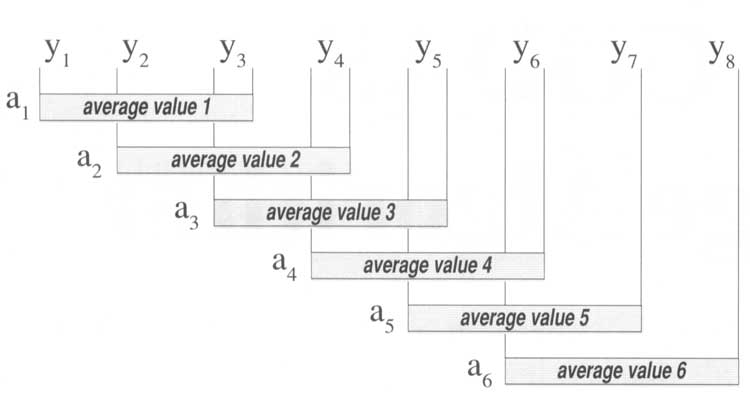

```{r setup, include=FALSE}
knitr::opts_chunk$set(dev = 'svg', warning = FALSE) 
# выбор векторного формата для графиков и отключение жалоб на русские шрифты на графиках
```


# Введение

В этом блокноте рассмотрены понятие временного ряда и компонентов временного ряда. 
Показано использование доступных в R инструментов для загрузки данных временных рядов и исследования их структуры.


```{r Подключение библиотек, warning=FALSE, message=FALSE}
library(tidyverse) # визуализация и трансформация данных
library(forecast) # анализ временных рядов и прогнозирование
library(sophisthse) # Загрузка временных рядов из базы Sophist
library(zoo) # Поддержка высокочастотных рядов
library(lubridate) # обработка дат
library(scales) # Форматирование осей на графиках ggplot2
library(ggseas) # Расширения ggplot для временных рядов
library(fpp) # Примеры временных рядов
library(quantmod) # Загрузка финансовых данных из Интернет
```

# Понятие временного ряда

**Временной ряд** (*time series*) - последовательность наблюдений некоторого процесса, зафиксированных в определенные моменты времени. С помощью анализа временных рядов можно прогнозировать развитие различных процессов во времени (продажи, заказы, цены, информационные и материальные потоки).

Многие методы анализа и прогнозирования временных рядов требуют, чтобы наблюдения временного ряда были выполнены через одинаковые интервалы времени, например ежегодно, ежеквартально, ежемесячно, еженедельно, ежедневно, ежечасно. Такие временные ряды называются **регулярными** (*regular time series*).  

**Нерегулярные временные ряды** (*irregular time series*) распростространены в естественных науках, технике, биржевой торговле, но в этом курсе такие ряды не будут рассматриваться подробно.

**Прогнозирование временных рядов** (*time series forecasting*) направлено на оценку будущих значений временного ряда на основе выделения в исторических данных закономерных компонентов (*regular components*), при этом, как правило ставится как задача оценки ожидаемых будущих значений - **точечный прогноз** (*point forecast*), так и задача оценки степени неопределенности при помощи доверительных интервалов - **интервальный прогноз** (*interval forecast*).

Закономерные компоненты временного ряда включают:

  - **уровень** (*level*) - среднее значение временного ряда;

  - **тренд** (*trend*) - постепенное, долгосрочное изменение среднего уровня ряда;

  - **сезонность** (*seasonality*) - регулярные изменения уровня ряда, происходящие в определенные периоды (например, сезонное увеличение продаж потребительских товаров перед новогодними праздниками, повышенный спрос на прохладительные напитки в летний период). Сезонные изменения повторяются в определенном цикле (например, годовом, недельном или суточном). Длительность (количество периодов) этого цикла считается известной и неизменной.

Кроме того, временные ряды могут содержать и другие компоненты:

  - **Циклы** (*сycles*) - периоды подъема и спада, не имеющие четко выраженной периодичности. Как правило, такие изменения связаны с крупномасштабными изменениями в экономике и имеют долгосрочный характер (годы). Не следует путать эти колебания с сезонностью, циклы не связаны с определенными периодами года. При анализе временных рядов циклы обычно "сливаются" с трендом, поскольку не существует методов, которые могли бы надежно прогнозировать экономические циклы.

  - **Нерегулярный компонент**, или **остаток** (*irregular component*, *error*, *residual*)  - это все остальные изменения, не учтенные закономерными компонентами.

## Примеры временных рядов

В этом блокноте мы рассмотрим несколько примеров временных рядов.

```{r График продаж электроэнергии}

elecsales %>%
  autoplot() +
    labs(y = 'ГВт-ч', x = NULL,
       title = 'Ежегодные продажи электроэнергии бытовым потребителям (Австралия)',
       caption = 'Источник: Australian Energy Market Operator, fpp') +
  geom_line(color = 'blue') +
  scale_x_continuous(minor_breaks = 1989:2008)

```

```{r График продаж односемейных домов}
hsales %>%
  autoplot() +
    labs(y = 'млн',  x = NULL,
       title = 'Ежемесячные продажи новых частных домов (США)',
       caption = 'Источник: US Census Bureau, Manufacturing and Construction Division') +
  geom_line(color = 'blue') +
  scale_x_continuous(minor_breaks = 1973:1996)

```

```{r График производства электроэнергии}
elec %>%
  autoplot() +
    labs(y = 'ГВт-ч',  x = NULL,
       title = 'Ежемесячное производство электроэнергии (Австралия)',
       caption = 'Источник: Makridakis, Wheelwright and Hyndman (1998) Forecasting: methods and applications') +
  geom_line(color = 'blue') +
  scale_x_continuous(minor_breaks = 1955:1997,
                     breaks = seq(1955, 1995, by = 5))

```


```{r График производства электронного оборудования}
elecequip %>%
  autoplot() +
    labs(y = 'Индекс (2005.1=100)',  x = NULL,
       title = 'Ежемесячный индекс производства электронного оборудования \n(16 стран ЕС)',
       caption = 'Источник: Eurostat')  +
  geom_line(color = 'blue') +
  scale_x_continuous(minor_breaks = 1995:2013,
                   breaks = seq(1996, 2015, by = 2))


```

```{r График производства пива}
ausbeer %>%
  autoplot() +
    labs(y = 'мегалитры',  x = NULL,
       title = 'Ежеквартальный объем производства пива (Австралия)',
       caption = 'Источник: Australian Bureau of Statistics. Cat. 8301.0.55.001') +
  geom_line(color = 'blue') +
  scale_x_continuous(minor_breaks = 1955:2010,
                   breaks = seq(1955, 2010, by = 5))
  
```

Загрузим данные о курсе Евро к рублю из Интернет с помощью `quantmod::getSymbols()`:

```{r Загрузка курса Евро к рублю из Интернет, warning=FALSE, message=FALSE}
euro <- getSymbols('EUR/RUB', 
                   src = 'oanda', 
                   from = today() - months(6),
                   auto.assign = FALSE)

```

Визуализация курса:

```{r График курса Евро}
# Для объектов zoo синтаксис отличается, см. ?autoplot.zoo
euro %>%
  autoplot() + 
    labs(y = 'руб/Евро', x = NULL,
       title = 'Курс Евро за 6 месяцев') +
    scale_x_date(date_breaks = '1 months') + 
  geom_line(color = 'blue')

# График курса за 6 недель
euro %>%
  window(start = today() - weeks(6)) %>%
    autoplot() +
      labs(y = 'руб/Евро', x = NULL,
         title = 'Курс Евро за 6 недель') +
      scale_x_date(date_breaks = '1 week') +
  geom_line(color = 'blue')

```


```{r График рождаемости}

babies <- read.zoo('data/babies.tsv', 
                   format = '%d.%m.%Y', head = TRUE)

# График за 2 года
babies %>%
  window(start = dmy('01.01.1988')) %>%
  autoplot() +
    labs(y = 'число новорожденных', x = NULL,
       title = 'Ежедневные данные о рождаемости (один из штатов Канады)') +
    scale_x_date(date_minor_breaks = '1 month') +
  geom_line(color = 'blue')

# График за 1 месяц
babies %>% 
  window(start = dmy('01.09.1988'),
         end = dmy('30.09.1988')) %>%
  autoplot() +
    labs(y = 'число новорожденных', x = NULL,
       title = 'Ежедневные данные о рождаемости (один из штатов Канады)') +
    scale_x_date(date_minor_breaks = '1 day', date_breaks = '1 week',
                 date_labels = '%d.%m.%y (%a)') +
  geom_line(color = 'blue')

# Коды форматов дат - см. ?strptime

```


------------------


# Методы анализа временных рядов

## Сглаживание 

Временные ряды со значительным случайным компонентом сложно анализировать, т.к. закономерности поведения ряда теряются в шумах. Чтобы упростить анализ закономерных компонент, применяются методы **сглаживания** временных рядов (*smoothing*). Сглаживание подавляет случайные колебания и позволяет лучше видеть тренд.

Одним из наиболее простых методов сглаживания является **скользящее среднее** (*moving average*). Например, каждое наблюдение ряда можно заменить средним значением, включающим это и два соседних наблюдения раньше и позже данного. Такой способ вычисления соответствует **центрированному скользящему среднему порядка 3** (*centered moving average of order 3*).



Формула для расчета центированного скользящего среднего:

$$ MA_t = \frac{ y_{t-q} + \ldots + y_t + \ldots + y_{t+q} } {k} $$


Здесь $MA_t$ - сглаженное значение для периода $t$,  а порядок $k = 2q + 1$ - количество усредняемых значений ряда. Для центрированного скользящего среднего порядок должен быть нечетным (odd).

Центрированное скользящее среднее невозможно вычислить для первых и последних $q$ наблюдений, т.к. окно сглаживания (*smoothing window*) для этих периодов выходит за пределы данных.

Увеличение порядка усиливает степень сглаживания и сокращает количество наблюдений

```{r Влияние порядка сглаживания}

autoplot(elecsales, series = 'Оригинал') +
  autolayer(ma(elecsales, order = 3), series = 'СС 3') +
  autolayer(ma(elecsales, order = 7), series = 'СС 7') +
  scale_color_manual(values = c('blue', 'orange', 'red')) +
  labs(y = 'ГВт-ч', x = NULL,
       title = 'Ежегодные продажи электроэнергии бытовым потребителям\n (Австралия)',
       color = NULL)

```

Эффект сглаживания в наибольшей степени проявляется в высокочастотных временных рядах. Этот метод может использоваться для выделения тренда.


```{r Выделение тренда с помощью скользящего среднего}

babies88 <- babies %>% 
  window(start = dmy('01.01.1988'))


autoplot(cbind('Оригинал' = babies88,
               '3-месячное СС' = rollmean(babies88, 91)),
         facets = NULL) + 
  
  scale_color_manual(values = c('blue', 'red')) +
  
  labs(y = 'число новорожденных', x = NULL,
       title = 'Ежедневные данные о рождаемости (один из штатов Канады)',
       color = NULL)

```

**Замечание**: Функция `forecast::autolayer()` не работает с рядами `zoo`, поэтому приходится рисовать несколько рядов "склеивая" из них один многомерный ряд при помощи `cbind()`. Многомерный ряд представляет собой матрицу, где каждый временной ряд - это столбец:

```{r Как выглядит многомерный временной ряд}
cbind('Оригинал' = babies88, 
      '3-месячное СС' = rollmean(babies88, 91)) %>%
        window(start = ymd('1988-03-01'),
               end = ymd('1988-03-07'))
```


С помощью пакета `ggseas` можно вычислять другие функции для сглаживания рядов, например, скользящую медиану.

```{r Выделение тренда с помощью скользящей медианы}

ausbeer_df <- tsdf(ausbeer) # Преобразовать ряд в датафрейм

ggplot(ausbeer_df, aes(x, y)) + 
  
  geom_line(aes(color = 'Оригинал')) +
  
  stat_rollapplyr(width = 12, 
                  FUN = median, 
                  align = 'center', aes(color = 'Медиана')) +

  labs(y = 'мегалитры',  x = NULL,
       title = 'Ежеквартальный объем производства пива (Австралия)',
       color = NULL) +
  
  scale_color_manual(values = c('red', 'blue'))
```


## Декомпозиция временных рядов

Временной ряд можно рассматривать как совокупность трех компонентов - тренд-циклического (*trend-cycle*), сезонного (*seasonal*) и нерегулярного (*irregular*). Для описания ряда можно использовать либо **аддитивную**:

$$ y_t = S_t + T_t + E_t, $$

либо **мультипликативную** модель:

$$ y_t = S_t \cdot T_t \cdot E_t. $$

Аддитивная модель применяется если амплитуда сезонных и случайных колебаний не увеличивается с увеличением среднего уровня ряда. Если же амплитуда колебаний пропорциональна среднему уровню, то необходимо использовать мультипликативную модель ряда.

Если мультипликативную модель использовать невозможно (например, ее не поддерживает инструмент анализа данных), то можно преобразовать данные, чтобы исключить эффект увеличения амплитуды колебаний с ростом уровня. Одним из способов добиться этого эффекта является логарифмирование:

Если: $$ y_t = S_t \cdot T_t \cdot E_t, $$ 


то $$ \log y_t = \log S_t + \log T_t + \log E_t $$
    
    
    
### Классическая сезонная декомпозиция

В методе **классической сезонной декомпозиции** (*classical decomposition*) для выделения тренда используется центрированное скользящее среднее. Это приводит к потере данных на концах временного ряда. 


Рассмотрим этот метод на примере мультипликативного временного ряда.

1. Вычисляется центрированное скользящее среднее с порядком не менее длины сезонного цикла. В результате получается оценка тренда $\hat{T}$.

2. Из данных исключается тренд: $y_t / \hat{T_t}$.

3. Определяется сезонный индекс для каждого месяца, для этого усредняются наблюдения для этого месяца с удаленным трендом. Например, при расчете сезонного индекса для октября необходимо усреднить все наблюдения за этот период в разные годы (после удаления тренда).

4. Сезонные индексы корректируются, чтобы их среднее значение было равно 1.

5. Выделяется нерегулярный компонент путем деление на тренд и сезонный индекс для соответствующего периода:
  
  $$ \hat{E_t} = y_t / (\hat{T_t} \cdot \hat{S_t}). $$

В случае аддитивного ряда алгоритм аналогичен, за исключением шагов 2 и 5, где вместо деления используется вычитание. Корректировка сезонных индексов производится таким образом, чтобы их сумма была равна 0.


```{r Классическая декомпозиция мультипликативного ряда, warning=FALSE}

elec_d <- elec %>%
  decompose(type = 'multiplicative')

autoplot(elec_d) +
  labs(title = 'Декомпозиция мультипликативного ряда')

```

Объект, полученный при декомпозиции, содержит следующие элементы:

```{r Структура объекта decompose}
# Структура объекта
names(elec_d)
```


Извлечь компоненты временного ряда можно напрямую, по их имени, либо с помощью функций пакета `forecast`: `trendcycle()`, `seasonal()`, `remainder()`.

```{r Извлечение компонентов ряда}
# По имени
elec_d$seasonal %>% head()

# При помощи функции
seasonal(elec_d) %>% head()
```


Модель ряда:

```{r Визуализация компонентов ряда на одном графике}

autoplot(elec, series = 'Оригинал') +
  autolayer(trendcycle(elec_d), series = 'Тренд') +
  autolayer(trendcycle(elec_d) * seasonal(elec_d),
            series = 'Модель ряда') +
  scale_color_manual(values = c('red', 'blue', 'green')) +

    labs(y = 'ГВт-ч', x = NULL,
     title = 'Ежемесячное производство электроэнергии (Австралия)',
     color = NULL)
  
```


Остаток (нерегулярный компонент) ряда:

```{r Визуализация остатка}
autoplot(remainder(elec_d)) +
  geom_line(color = 'darkgray') +
  labs(y = NULL, x = NULL,
     title = 'Нерегулярный компонент ряда')
```


Выполним декомпозицию аддитивного ряда


```{r Классическая декомпозиция аддитивного ряда, warning=F}

elecequip_d <- elecequip %>%
  decompose(type = 'additive')

autoplot(elecequip_d) +
  labs(title = 'Декомпозиция аддитивного ряда')

```


Модель ряда:

```{r Компоненты аддитивного ряда на одном графике}

autoplot(elecequip, series = 'Оригинал') +
  autolayer(trendcycle(elecequip_d), series = 'Тренд') +
  autolayer(trendcycle(elecequip_d) + seasonal(elecequip_d),
            series = 'Модель ряда') +
  labs(y = 'Индекс (2005=100)', x = NULL,
       title = 'Ежемесячный индекс производства\nэлектронного оборудования (16 стран ЕС)', 
       color = NULL) +
  scale_color_manual(values = c('red', 'blue', 'green'))

```


Остаток:

```{r}
autoplot(remainder(elecequip_d)) +
  geom_line(color = 'darkgray') +
  labs(y = NULL, x = NULL,
     title = 'Нерегулярный компонент ряда')

```


## STL-декомпозиция

Недостатком метода классической декомпозиции является потеря данных на концах ряда из-за использования скользящего среднего. В R реализован один из методов, позволяющих преодолеть этот недостаток - метод **STL-декомпозиции** (*Seasonal and Trend decomposition using Loess*). 

[Loess](https://en.wikipedia.org/wiki/Local_regression) - это метод основанный на регрессии метод сглаживания, который используется для выявления нелинейных зависимостей.

Преимущества STL-декомпозиции:

  - нет потери данных на концах ряда  
  - может использоваться с любой длительностью сезонного цикла, поддерживаются не только месяцы, кварталы или недели  
  - сезонный компонент может со временем изменяться  
  - метод устойчив к выбросам (*robust*), если пользователь выбрал соответствующий параметр. В этом случае нетипичные наблюдения не используются для оценки тренд-циклической компоненты и попадают в остаток.

Недостком реализации этого метода в R является невозможность использования с мультипликативными временными рядами. Однако ряд можно сделать аддитивным с помощью логарифмирования.

```{r STL-декомпозиция аддитивного ряда}

elecequip_sd <- elecequip %>%
  stl(s.window = 'periodic')
  
  #параметр: s.window='periodic' делает сезонные коэффициенты постоянными

autoplot(elecequip_sd) +
  labs(title = 'STL-декомпозиция аддитивного ряда')

```

Метод STL позволяет сделать сезонные коэффициенты адаптивными, в этом случае они постепенно подстраиваются при изменении сезонного компонента ряда. Параметр окна сглаживания `s.window = ` позволяет задать скорость реакции на изменения (чем больше значение, тем медленнее изменение).

```{r STL-декомпозиция мультипликативного ряда 1}
# Попытка #1 - разрешаем сезонному компоненту постепенно меняться
elec_sd <- elec %>% 
  stl(s.window = 7)

autoplot(elec_sd) +
  labs(title = 'STL декомпозиция мультипликативного ряда')

```

Вместо этого можно воспользоваться логарифмированием, чтобы сделать ряд аддитивным:

```{r STL-декомпозиция мультипликативного ряда 2}
# Попытка #2 -логарифмирование данных
elec_sd_log <- elec %>% 
  log() %>% 
  stl(s.window = 'periodic')

autoplot(elec_sd_log) +
  labs(title = 'STL декомпозиция мультипликативного ряда, логарифмирование')

```


```{r Структура объекта после STL-декомпозиции}
# Имена
names(elecequip_sd) 

# Компоненты ряда хранятся внутри вложенного объекта time.series
elecequip_sd$time.series %>% head(3)  

# Это матрица, а не список, $ не работает, используйте []
elecequip_sd$time.series[, 'seasonal'] %>% head()

```

Для извлечения компонентов удобнее использовать функции `trendcycle()`, `seasonal()`, `remainder()`.


Модель ряда:

```{r График с компонентами после STL-декомпозиции}
# Все компоненты на одном графике

autoplot(elecequip, series = 'Оригинал') +
  autolayer(trendcycle(elecequip_sd), series = 'Тренд') +
  autolayer(trendcycle(elecequip_sd) + seasonal(elecequip_sd),
            series = 'Модель ряда') +
  labs(y = 'Индекс (2005=100)', x = NULL,
       title = 'Ежемесячный индекс производства\nэлектронного оборудования (16 стран ЕС)', 
       color = NULL) +
  scale_color_manual(values = c('red', 'blue', 'green'))


```

Остаток:

```{r Остаток ряда при STL-декомпозиции}
autoplot(remainder(elecequip_sd)) +
  labs(y = NULL, x = NULL,
     title = 'Нерегулярный компонент ряда') +
  geom_line(color = 'darkgray')

```

Если при декомпозиции мультипликативного ряда применялось логарифмирование, то получить данные в исходном масштабе можно с помощью обратного преобразования: 

$$ log ^{-1}(x) \equiv exp(x)$$


## Сезонная корректировка

**Сезонная корректировка** (*seasonal adjustment*) исключает сезонный компонент ряда. Полученный ряд будет содержать только тренд и нерегулярный компонент. В зависимости от применяемой модели ряда, производится деление на сезонные индексы, или вычитание этих индексов.

Аддитивная модель:

$$ A_t = y_t - \hat{S_t} = T_t + E_t$$

Мультипликативная модель:

$$ A_t = y_t / \hat{S_t} = T_t \cdot E_t$$

Сезонная корректировка применяется для упрощения анализа трендов при визуализации или моделировании данных. 

В R сезонная корректировка реализована в нескольких пакетах. Например, можно использовать функцию `forecast::seasadj()`. 

```{r Сезонная корректировка ряда}
ausbeer_sd <- ausbeer %>% stl(s.window = 7, t.window = 21)
ausbeer_sas <- seasadj(ausbeer_sd)

autoplot(ausbeer, series = 'Оригинал') +
  autolayer(trendcycle(ausbeer_sd), series = 'Тренд') +
  autolayer(ausbeer_sas, series = 'Скорректированный ряд') +
                
  labs(y = 'мегалитры', x = NULL,
     title = 'Ежеквартальный объем производства пива (Австралия)',
     color = 'Ряд') +
  scale_color_manual(values = c('blue', 'orange', 'red'))

```

Другая возможность - использование пакета `ggseas` [см. здесь](http://ellisp.github.io/blog/2016/03/28/ggseas-update) и [здесь](https://github.com/ellisp/ggseas).
