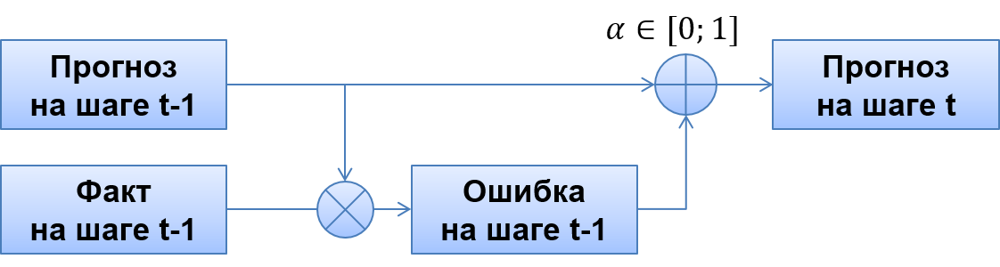

```{r Настройка, include=TRUE}
options(digits = 3) # Количество значащих цифр при выводе
```


```{r Подключение библиотек, warning=FALSE, message=FALSE}
library(tidyverse) # визуализация и трансформация данных
library(forecast) # анализ временных рядов и прогнозирование
library(fpp) # Примеры временных рядов
library(sophisthse) # Загрузка временных рядов из базы Sophist
```


# Введение

Методы экспоненциального сглаживания начиная с середины XX века широко применяются для анализа временных рядов и прогнозирования в технике и управлении. Применение методов экспоненциального сглаживания для прогнозирования включает два этапа: сначала на основе имеющихся данных получают оценки для закономерных компонентов ряда - *уровня*, *тренда* (скорости роста) и *сезонных коэффициентов*. Затем, комбинируя наиболее свежие оценки закономерных компонентов ряда, строится прогноз на будущее. 

Оценки закономерных компонентов при получении новых данных корректируются с использованием ошибки прогноза на текущем шаге и **константы сглаживания**, которая задает долю от величины ошибки, которая будет использоваться для корректировки прогноза. На рисунке показана схема работы метода простого экспоненциального сглаживания.



Сглаженное значение на шаге $t$ определяется по формуле:

$$ L_t = L_{t-1} + \alpha (y_t - L_{t-1}) = L_{t-1} + \alpha e_t $$

Своим названием методы обязаны тому, что при развертывании рекуррентной формулы, приведенной выше, прошлые наблюдения получают экспоненциально затухающие веса:

$$ 
  L_t = L_{t-1} + \alpha (y_t - L_{t-1}) = \alpha y_t + L_{t-1} (1 - \alpha) = \\
    \alpha y_t + \alpha (1 - \alpha) y_{t-1} + (1 - \alpha)^2 L_{t-2} = \\
    \alpha y_t + \alpha (1 - \alpha) y_{t-1} + \alpha (1 - \alpha)^2 y_{t-2} + (1 - \alpha)^3 L_{t-3} 
$$

Поскольку $\alpha < 1$, наиболее свежие наблюдения получают большие веса, чем более давние наблюдения.

```{r Коэффициенты в методе простого экспоненциального сглаживания}
# Значение константы сглаживания
a <- 0.5
# Коэффициенты
i <- 0:9
coefs <- a * (1 - a)^i
# Визуализация
ggplot(tibble(x = factor(i), y = coefs)) +
  geom_bar(aes(x, y), stat = 'identity', fill = 'lightskyblue', width = 0.25) + 
  labs(title = paste('Веса прошлых наблюдений при alpha = ', a),
       x = 'Лаг', y = 'Вес наблюдения')

```

Методы экспоненциального сглаживания позволяют быстро получать прогнозы для широкого спектра временных рядов и способны адаптироваться к изменению закономерных компонентов ряда. Это сделало их одним из наиболее популярных и успешных подходов при разработке инструментов автоматизированного прогнозирования.

В этом блокноте будут рассмотрены классические методы экспоненциального сглаживания - простое экспоненциальное сглаживание, метод Хольта и метод Винтерса.

Материал составлен на основе [7 главы](https://www.otexts.org/fpp2/ch-expsmooth.html) 
книги: *Hyndman R, Athanasopoulos G. Forecasting Principles and Practice, 2nd Edition*.


# Простое экспоненциальное сглаживание

Метод **простого экспоненциального сглаживания** (*simple exponential smoothing, SES*) позволяет выделить лишь среднее значение временного ряда - **уровень** (*Level*). Для получения этого компонента используется формула:

$$ L_t = y_t \cdot \alpha + L_{t-1} \cdot (1 - \alpha), $$

где $\alpha \in [0, 1]$ - константа сглаживания, которая определяет скорость реакции уровня ряда $L$ на изменения в наблюдаемых значениях $y$. Чем больше $\alpha$, тем быстрее уровень реагирует на изменения и тем меньше сглаживание. 

При $\alpha = 0$ обновление уровня не происходит при изменении $y$, сохраняется начальное значение уровня - $L_1$.

Первоначальное значение уровня - $L_1$ необходимо задать (**инициализировать**).

При прогнозировании в методе простого экспоненциального сглаживания применяется наивный подход, предполагающий, что все последующие наблюдения будут такими же, как и последнее значение уровня:

$$ \hat{y}_{T+h} = L_{T} =const $$

По этой причине простое экспоненциальное сглаживание может применяться для прогнозирования только временных рядов, в которых нет выраженного тренда или сезонности, либо рядов, из которых эти компоненты были удалены.

## Пример

Рассмотрим работу метода на примере ежемесячных продаж новых частных домов в США (см.`?hsales`).
Метод реализован функцией `forecast::ses()` (см. `?ses`)

```{r Модель простого экспоненциального сглаживания}
hs90 <- window(hsales, start = 1990)
hs90_label <- 'Ежемесячные продажи новых частных домов в США'

# Прогноз на 24 месяца
hs90_fit <- ses(hs90, h = 24)

# Константа сглаживания и начальное значение уровня подбираются автоматически по критерию минимизации суммы квадратов ошибок прогноза на 1 шаг

# Сводка по модели
summary(hs90_fit)

# График прогноза
autoplot(hs90_fit) +
  labs(title = hs90_label,
       fill = 'Доверительный\nинтервал',
       x = NULL, y = NULL)
```

```{r Структура объекта}
# Структура объекта, возвращаемого функцией ses():
names(hs90_fit)
```

Полезные имена компонентов:  
 - `fitted` - прогноз на 1 шаг в историческом периоде (можно извлечь функцией `fitted()`);  
 - `mean` - прогноз на будущее (ожидаемое значение);  
 - `lower`/`upper` - границы доверительного интервала;   
 - `model$states` - компоненты ряда  в историческом периоде (в методе простого экспоненциального сглаживания - только уровень);  
 - `model$par` - параметры модели.

Для аннотирования графиков полезно выделить значения параметров модели: 

```{r Получение параметров модели}
# Как добраться до параметров
hs90_fit$model$par
```

Выделим автоматически подобранное значение константы сглаживания $\alpha$ :

```{r Выделение константы сглаживания для продаж жилых домов}
hs90_alpha <- hs90_fit$model$par['alpha']
hs90_alpha
```


Полученное значение константы сглаживания близко к 1, следовательно сглаживания исходных данных при оценке уровня ряда практически не происходит. На графике уровень ряда, оцененный по модели экспоненциального сглаживания совпадает с историческими значениями.

```{r Уровень ряда и факт - простое ЭС}

autoplot(hs90, series = 'Факт') +
  autolayer(hs90_fit$model$states, series = 'Уровень') +
  autolayer(hs90_fit, PI = FALSE, series = 'Прогноз') +
  annotate(geom = 'text', x = 1997, y = 30, 
           label = paste('alpha =', round(hs90_alpha, 4))) +
  labs(title = hs90_label,
     color = NULL,
     x = NULL, y = NULL)

```


Рассмотрим, как влияет константа сглаживания на результат.

```{r Влияние константы сглаживания}
fit1 <- ses(hs90, alpha = 0.1, h = 24)
fit2 <- ses(hs90, alpha = 0.4, h = 24)


autoplot(hs90, series = 'Факт') +
  autolayer(fit1$model$states, series = 'Уровень, a = 0.2') +
  autolayer(fit2$model$states, series = 'Уровень, a = 0.4') +
  autolayer(fit1, PI = FALSE, series = 'Прогноз, a = 0.2') +
  autolayer(fit2, PI = FALSE, series = 'Прогноз, a = 0.4') +
  labs(title = hs90_label,
     color = NULL,
     x = NULL, y = NULL) +
  
  scale_color_manual(values = c('dodgerblue', 'darkgreen', 
                                'lightskyblue', 'green', 'darkgray'))

```


# Метод Хольта (с линейным трендом)

В методе Хольта с помощью экспоненциального сглаживания выделяются два закономерных компонента ряда - **уровень** (*Level*) и **скорость роста** (*Trend*):

$$ L_t = y_t \cdot \alpha + (L_{t-1} + b_{t-1})\cdot (1-\alpha) $$

$$ b_t = (L_t - L_{t-1}) \cdot \beta + b_{t-1} \cdot (1-\beta) $$

Для прогнозирования используются последние значения уровня и тренда, т.е. скорости роста ряда:

$$ \hat{y}_{T+h} = L_{T} + h \cdot b_T $$

## Пример
В R метод Хольта реализован функцией `forecast::holt()`.

```{r Модель Хольта}
# Прогноз на 24 месяца
hs90_holt <- holt(hs90, h = 24) 
# Константы сглаживания и начальное значение уровня и тренда подбираются автоматически

# Сводка по модели
summary(hs90_holt)

# График прогноза
autoplot(hs90_holt) +
  labs(title = hs90_label,
       fill = 'Доверительный\nинтервал',
       x = NULL, y = NULL)
```

Из сводки по модели видно, что константы сглаживания для тренда и имеют близкие к предельным значения (1 и 0 соответственно). Такая модель практически не сглаживает случайные колебания ряда, и не обновляет тренд при поступлении новых данных.

При необходимости, параметры можно извлечь из модели в виде вектора:

```{r Параметры модели хольта}
hs90_holt$model$par %>%
  round(5)
```


```{r Уровень, факт и прогноз - метод Хольта}

autoplot(hs90, series = 'Факт') +
  autolayer(hs90_holt$model$states[,'l'], series = 'Уровень') +
  autolayer(hs90_holt, PI = FALSE, series = 'Прогноз') +
  labs(title = hs90_label,
     color = NULL,
     x = NULL, y = NULL)

```

```{r Компоненты ряда - метод Хольта}

cbind('Ряд' = hs90, 
      'Уровень' = hs90_holt$model$states[, 'l'],
      'Тренд' = hs90_holt$model$states[, 'b']) %>% 
  autoplot(facets = T) + 
  labs(title = hs90_label, y = NULL, x = NULL, color = 'Обозначения')

```


Вспомним, что автоматический подбор параметр основан на сравнении прогноза в историческом периоде и факта и минимизации ошибки подгонки модели. Но модель, которая хорошо объясняет прошлое - не обязательно хорошо предсказывает будущее.  

В данном случае очевидно, что компоненты модели плохо адаптируются к данным из-за неудачно подобранных констант. Зададим константы вручную.

```{r Метод Хольта, подбор констант вручную}
# Прогноз на 24 месяца
hs90_holt_man <- holt(hs90, alpha = 0.2, beta = 0.05, h = 24) 
# Начальное значение уровня и тренда подбираются автоматически, константы заданы вручную

# Компоненты ряда
autoplot(cbind('Ряд' = hs90, 
               'Уровень' = hs90_holt_man$model$states[, 'l'],
               'Тренд' = hs90_holt_man$model$states[, 'b']), 
         facets = T) +
  labs(title = hs90_label, y = NULL, x = NULL, color = 'Обозначения')

# Прогноз
autoplot(hs90, series = 'Факт') +
  autolayer(hs90_holt_man$model$states[,'l'], series = 'Уровень') +
  autolayer(hs90_holt_man, PI = FALSE, series = 'Прогноз') +
  labs(title = hs90_label,
     color = NULL, x = NULL, y = NULL)


```


# Метод Винтерса

Метод Винтерса позволяет учитывать как скорость изменения ряда, так и сезонность. Существует две модификации метода Винтерса, которые отличаются подходом к учету сезонности: мультипликативная и аддитивная модели.


## Мультипликативная модель Винтерса

В мультипликативной модели Винтерса компоненты выделяются по формулам:

$$ L_t = \left( \frac{y_t}{S_{t-m}} \right) \cdot \alpha + (L_{t-1} + b_{t-1})\cdot (1-\alpha) $$

$$ b_t = (L_t - L_{t-1}) \cdot \beta + b_{t-1} \cdot (1-\beta) $$

$$ S_t = \frac{y_t} {L_t} \cdot \gamma + S_{t-m} \cdot (1-\gamma) $$
Здесь $m$ - длина сезонного цикла.

Для прогнозирования используется уравнение:

$$ \hat{y}_{T+h} = (L_{T} + h \cdot b_T) \cdot S_{T-m+h} $$


## Пример

В R мультипликативная модель Винтерса реализуется функцией `forecast::hw()` с параметром `seasonal = 'multiplicative')`.

```{r Мультипликативная модель Винтерса}
# Прогноз на 24 месяца
hs90_winters_m <- hw(hs90, h = 24, seasonal = 'multiplicative') 
# Константы сглаживания и начальное значение уровня и тренда подбираются автоматически

# Сводка по модели
summary(hs90_winters_m)

# График прогноза
autoplot(hs90_winters_m) +
  labs(title = hs90_label,
       fill = 'Доверительный\nинтервал',
       x = NULL, y = NULL)

```

Коэффициенты модели:

```{r Коэффициенты мультипликативной модели Винтерса}
hs90_winters_m$model$par %>% round(3)
```

Компоненты ряда:

```{r Компоненты ряда - мультипликативная модель Винтерса}
autoplot(cbind('Ряд' = hs90, 
               'Уровень' = hs90_winters_m$model$states[, 'l'],
               'Тренд' = hs90_winters_m$model$states[, 'b'],
               'Сезонность' = hs90_winters_m$model$states[, 's1']),       
         facets = T) +
  labs(title = hs90_label, y = NULL, x = NULL, color = 'Обозначения')

```


## Аддитивная модель Винтерса

В аддитивной модели Винтерса компоненты выделяются по формулам:

$$ L_t = ( y_t - S_{t-m} ) \cdot \alpha + (L_{t-1} + b_{t-1})\cdot (1-\alpha) $$

$$ b_t = (L_t - L_{t-1}) \cdot \beta + b_{t-1} \cdot (1-\beta) $$

$$ S_t = (y_t - L_t) \cdot \gamma + S_{t-m} \cdot (1-\gamma) $$


Для прогнозирования используется уравнение:

$$ \hat{y}_{T+h} = (L_{T} + h \cdot b_T) + S_{T-m+h} $$


## Пример

В R аддитивная модель Винтерса реализуется функцией `forecast::hw()` с параметром `seasonal = 'additive')`.

```{r Аддитивная модель Винтерса}
# Прогноз на 24 месяца
hs90_winters_a <- hw(hs90, h = 24, seasonal = 'additive') 
# Константы сглаживания и начальное значение уровня и тренда подбираются автоматически

# Сводка по модели
summary(hs90_winters_a)

# График прогноза
autoplot(hs90_winters_a) +
  labs(title = hs90_label,
       fill = 'Доверительный\nинтервал',
       x = NULL, y = NULL)
```


Коэффициенты модели:

```{r Коэффициенты аддитивной модели Винтерса}
hs90_winters_a$model$par %>% round(3)
```

Компоненты ряда:

```{r Компоненты ряда - аддитивная модель Винтерса}
autoplot(cbind('Ряд' = hs90, 
               'Уровень' = hs90_winters_a$model$states[, 'l'],
               'Тренд' = hs90_winters_a$model$states[, 'b'],
               'Сезонность' = hs90_winters_a$model$states[, 's1']),       
         facets = T) +
  labs(title = hs90_label, y = NULL, x = NULL, color = 'Обозначения')

```


## Сравнение аддитивной и мультипликативной моделей Винтерса

### Визуальное сравнение

```{r Визуальное сравнение двух моделей}


autoplot(hs90, series = 'Факт') +
  autolayer(fitted(hs90_winters_m), series = 'Подгонка, мульт.') +
  autolayer(fitted(hs90_winters_a), series = 'Подгонка, адд.') +
  autolayer(hs90_winters_m$mean, series = 'Прогноз, мульт.') +
  autolayer(hs90_winters_a$mean, series = 'Прогноз, адд.') +
  labs(title = hs90_label, color = NULL,
     x = NULL, y = NULL) +
  
  scale_color_manual(values = c('dodgerblue', 'darkgreen', 
                                'lightskyblue', 'green', 'darkgray'))

```


### Сравнение параметров

```{r Параметры мультипликативной модели}
# Мультипликативная модель
hs90_winters_m$model$par[1:3] %>% round(4)
```


```{r Параметры аддитивной модели}
# Аддитивная модель
hs90_winters_a$model$par[1:3] %>% round(4)
```

### Сравнение ошибок на обучающем периоде

```{r Сравнение ошибок двух моделей}
acc <- rbind(accuracy(hs90_winters_m), 
             accuracy(hs90_winters_a))

rownames(acc) <- c('Мульт. модель', 'Адд.модель')
acc
```
```{r Сравнение ошибок на обучающем периоде}
rbind(accuracy(hs90_winters_m),
      accuracy(hs90_winters_a)) %>%
  as_tibble() %>%
  round(4) %>%
  mutate(`Метод` = c('Мультипликативная модель', 
                     'Аддитивная модель')) %>%
  select(`Метод`, MASE, MAPE, MPE) %>%
  arrange(MASE)
```

На обучающем периоде методы демонстрируют одинаковую точность.

Попробуем сравнить их на тестовом периоде:

```{r Сравнение прогнозов на тестовом периоде}

# Подготовка данных обучающего периода:
hs90_train <- 
  window(hs90, end = c(1994, 11))

# Построение моделей:
hs90_wa_expost <- hw(hs90_train, h = 12, seasonal = 'additive')
hs90_wm_expost <- hw(hs90_train, h = 12, seasonal = 'multiplicative')

# Визуализация прогнозов:
hs90 %>% window(start = 1993) %>%
  autoplot(series = 'Факт') +
    autolayer(hs90_wa_expost$mean,  series = 'Адд. модель') +
    autolayer(hs90_wm_expost$mean,  series = 'Мульт. модель') +
    labs(title = hs90_label,
       color = NULL,
       x = NULL, y = NULL)
```


```{r Сравнение ошибок на тестовом периоде}
# Сравнение ошибок в тестовом периоде:
rbind(
  accuracy(hs90_wa_expost, hs90)['Test set',],
  accuracy(hs90_wm_expost, hs90)['Test set',]) %>%
  as_tibble() %>%
  round(4) %>%
  mutate(`Метод` = c('Аддитивная модель', 
                     'Мультипликативная модель')) %>%
  select(`Метод`, MASE, MAPE, MPE) %>%
  arrange(MASE)

```

На тестовом периоде мультипликативная модель демонстрирует лучшее согласие с данными, однако отличие в показателях ошибки незначительно.

