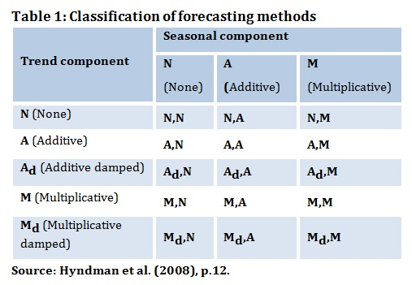
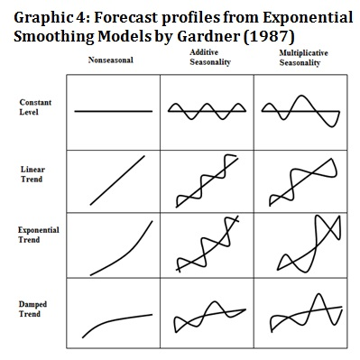

```{r Настройка, include=TRUE}
knitr::opts_chunk$set(dev = 'png', warning = FALSE) 
# выбор формата для графиков и отключение жалоб на русские шрифты на графиках
options(digits = 4) # Количество значащих цифр при выводе
```

```{r Подключение библиотек}
suppressMessages(library(tidyverse)) # ggplot2 и трансформация данных
suppressMessages(library(forecast)) # анализ временных рядов и прогнозирование
suppressMessages(library(ggfortify)) # Визуализация временных рядов с помощью ggplot2
suppressMessages(library(scales)) # Форматирование осей на графиках ggplot2
suppressMessages(library(fpp)) # Примеры временных рядов
suppressMessages(library(sophisthse)) # Загрузка временных рядов из базы Sophist

suppressMessages(library(stringr))  # Работа с текстовыми строками
suppressMessages(library(lubridate)) # обработка дат
suppressMessages(library(ggseas)) # Расширения ggplot для временных рядов
```

# Введение

В этом блокноте рассматриваются новые модели экспоненциального сглаживания с нелинейным трендом и вводится общая классификация моделей экспоненциального сглаживания, доступных в пакете `forecast`. Рассматривается получение доверительных интервалов для прогноза. Материал составлен на основе разделов [7.3-7.7](https://www.otexts.org/fpp/7) книги Hyndman R., Athanasopoulos G. Forecasting: Principles and practice.

В классическом методе Хольта используются следующие уравнения для выделения компонентов ряда:

 - Уровень: 

$$ L_t = y_t \cdot \alpha + (L_{t-1} + b_{t-1})\cdot (1-\alpha) $$

- Тренд (скорость роста): 

$$ b_t = (L_t - L_{t-1}) \cdot \beta + b_{t-1} \cdot (1-\beta) $$

Для прогнозирования используются последние значения уровня и скорости роста ряда:

$$ \hat{y}_{T+h} = L_{T} + h \cdot b_T $$

Таким образом, при прогнозировании предполагается линейный рост ряда. Однако многие природные и экономические процессы нелинейны. Поэтому были разработаны модификации модели Хольта, допускающие нелинейный тренд (экспоненциальный рост или затухание).

# Моделирование нелинейных трендов
## Модель Хольта с экспоненциальным трендом

Одной из модификаций метода Хольта является использование мультипликативного тренда, при котором скорость роста задается не как постоянная величина, а как заданный процент от достигнутого на предыдущем шаге уровня (коэффициент роста):

$$ \hat{y}_{T+h} = L_{T}  \cdot b_T^h $$

Поскольку теперь абсолютное увеличение прогноза на шаге растет с увеличением достигнутого уровня, как в формуле сложных процентов, - тренд экспоненциально возрастает. Данную модель можно использовать на этапе "взрывного" роста, например при выводе нового продукта или выходе на новый рынок. Пользоваться ей нужно с осторожностью, т.к. фаза неограниченного роста не продолжается бесконечно и с течением времени рост замедляется и затем сменяется спадом.

Модифицированные формулы для компонентов ряда: 

 - Уровень: 

$$ L_t = y_t \cdot \alpha + (L_{t-1} \cdot  b_{t-1})\cdot (1-\alpha) $$

- Тренд (скорость роста): 

$$ b_t = (L_t / L_{t-1}) \cdot \beta + b_{t-1} \cdot (1-\beta) $$


## Пример
В R метод Хольта c экспоненциальным трендом реализован функцией `forecast::holt()` с параметром: `exponential = TRUE`.

Сравним модели Хольта с линейным и экспоненциальным трендом на данных об объеме пассажирских авиаперевозок австралийскими авиакомпаниями (см. `?ausair`)


```{r Модель Хольта с экспоненциальным трендом}
air <- window(ausair, start = 1990, end = 2004) # Обучающий период
air_test <- window(ausair, start = 1990) # Обучающий + тестовый период

air_lin <- holt(air, alpha = 0.5, beta = 0.2, h = 5)
air_exp <- holt(air, alpha = 0.5, beta = 0.2, initial = 'simple', exponential = T, h = 5) # выбран простой метод инициализации начальных значений уровня и тренда; по умолчанию используется оптимизация и модель не строится


# Коэффициенты и ошибки модели с линейным трендом
coefficients(air_lin$model)
accuracy(air_lin)

# Коэффициенты и ошибки модели с экспоненциальным трендом
coefficients(air_exp$model)
accuracy(air_exp)

```


Визуальное сравнение моделей

```{r Визуальное сравнение моделей с линейным и экспоненциальным трендом}

autoplot(cbind('Факт' = air_test,
               'Линейный тренд' = air_lin$mean,
               'Экспоненциальный тренд' = air_exp$mean)) +
  labs(title = 'Ежегодный объем пассажирских перевозок\nавстралийскими авиалиниями', 
       x = NULL, y = 'млн чел.', colour = 'Обозначения')

```

Сравнение показателей ошибки на тестовом периоде.

```{r Сравнение показателей ошибки моделей с линейным и экспоненциальным трендом на тестовом периоде}

air_acc <- rbind(accuracy(air_lin, air_test)['Test set',], 
                 accuracy(air_exp, air_test)['Test set',])
rownames(air_acc) <- c('Линейный тренд', 'Экспоненциальный тренд')
air_acc

```


На тестовом периоде гипотеза об экспоненциальном росте числа пассажиров не подтвердилась и прогноз получился слишком оптимистичным. Тем не менее, более [свежие данные](http://data.is/x5KiEO) демонстрируют ускорение роста объемов авиаперевозок.


## Модель Хольта с затухающим трендом

Классическая и мультипликативная модели Хольта дают прогнозы, предполагающие неизменный или экспоненциально возрастающий рост в будущем. Данное предположение не всегда справедливо и в любом процессе может наступать период замедления роста и стагнации. Поэтому часто прогнозы по таким моделям оказываются завышенными. Для моделирования таких временных рядов используется модель с затухающим трендом, предложенная Gardner и McKenzie (1985). В этой модели введен еще один параметр: 

$$ 0 < \phi < 1, $$

который с течением времени уменьшает скорость роста. В пределе, тренд становится нулевым, а прогноз - горизонтальным. Модели с затухающим трендом показали хорошие результаты при практическом применении.

Коэффициент затухания тренда может использоваться совместно как с аддитивными, так и с мультипликативными моделями.

### Аддитивная модель с затухающим трендом

Уравнения для выделения компонентов ряда:

 - Уровень: 

$$ L_t = y_t \cdot \alpha + (L_{t-1} + \phi b_{t-1})\cdot (1-\alpha) $$

- Тренд (скорость роста): 

$$ b_t = (L_t - L_{t-1}) \cdot \beta + \phi b_{t-1} \cdot (1-\beta) $$

Уравнение для прогнозирования:

$$ \hat{y}_{T+h} = L_{T} + (\phi + \phi^2 + \dots + \phi^h)  b_T $$

При $ \phi  = 1 $ модель эквивалентна классической модели Хольта. При $ \phi < 1 $ тренд с течением времени постепенно затухает и прогноз становится горизонтальным. 


В пакете `forecast` модель с затухающим трендом реализована функцией `holt()` с параметром `damped = TRUE`. По умолчанию, диапазон возможных значений для параметра затухания $ \phi $ ограничен интервалом [0.8, 0.98].


### Мультипликативная модель с затухающим трендом

Эта модель была предложена в работе Taylor, 2003.

Уравнения для выделения компонентов ряда:

 - Уровень: 

$$ L_t = y_t \cdot \alpha + L_{t-1}  b_{t-1} ^ \phi \cdot (1-\alpha) $$

- Тренд (скорость роста): 

$$ b_t = (L_t / L_{t-1}) \cdot \beta + b_{t-1}^\phi \cdot (1-\beta) $$

Уравнение для прогнозирования:

$$ \hat{y}_{T+h} = L_{T}   b_T ^ {\phi + \phi^2 + \dots + \phi^h} $$

В пакете `forecast` модель с затухающим мультипликативным трендом реализована функцией `holt()` с параметрами `damped = TRUE, exponential = TRUE`. Эта модель дает менее консервативные прогнозы, чем аддитивная модель с затухающим трендом.


## Пример

Рассмотрим применение моделей с затухающим трендом на примере поголовья овец в Азии (см. `?livestock`  и [источник](http://data.is/GFxwQi).


```{r Модели с затухающим трендом для прогнозирования поголовья овец в Азии}
sheeps <- window(livestock, start = 1970, end = 1990)
sheeps_test <- window(livestock, start = 1970)

sheeps_lin <- holt(sheeps, h = 17)
sheeps_exp <- holt(sheeps, exponential = T, h = 17)
sheeps_ad <- holt(sheeps, damped = T, h = 17)
sheeps_md <- holt(sheeps, exponential = T, damped = T, h = 17)

cat('Коэффициенты моделей\n\n')
cat('Модель с линейным трендом\n')
coefficients(sheeps_lin$model)
cat('\nМодель с экспоненциальным трендом\n')
coefficients(sheeps_exp$model)
cat('\nМодель с аддитивным затухающим трендом\n')
coefficients(sheeps_ad$model)
cat('\nМодель с мультипликативным затухающим трендом\n')
coefficients(sheeps_md$model)


```


```{r Визуальное сравнение моделей с затухающим трендом}

autoplot(cbind('Факт' = sheeps_test,
               'Лин. тренд' = sheeps_lin$mean,
               'Эксп. тренд' = sheeps_exp$mean,
               'Адд. зат. тренд' = sheeps_ad$mean,
               'Мульт. зат. тренд' = sheeps_md$mean)) +
  labs(title = 'Поголовье овец в Азии',
       y = 'млн голов', x = NULL)

```


Сравнение показателей ошибки на тестовом периоде.

```{r Сравнение показателей ошибки моделей на тестовом периоде}

sheeps_acc <- rbind(accuracy(sheeps_lin, sheeps_test)['Test set',], 
                 accuracy(sheeps_exp, sheeps_test)['Test set',],
                 accuracy(sheeps_ad, sheeps_test)['Test set',],
                 accuracy(sheeps_md, sheeps_test)['Test set',])
rownames(sheeps_acc) <- c('Линейный тренд', 'Экспоненциальный тренд', 'Адд. затухающий тренд', 
                          'Мульт. затухающий тренд')
sheeps_acc

```

В данном примере наиболее близким к действительности оказался прогноз, полученный по модели Хольта.


## Задание - Модели с затухающим трендом

- Загрузите из ЕАЭСД (Sophist) данные по годовым показателям рождаемости ('POPFER_Y') и смертности ('POPMOR_Y') - в промилле (чел / 1000 чел населения).

```{r}

```

- Сравните динамику этих покзателей на одном графике
```{r}

```

- Определите, какую часть данных следует использовать для построения моделей


- Разделите данные на обучающий и тестовый (последние 5 лет) периоды

```{r}

```

- Для каждого показателя постройте модели с линейным, экспоненциальным, аддитивным затухающим и мультипликативным затухающим трендом (на обучающем периоде)

```{r}

```

- Сравните согласие моделей с фактом на тестовом периоде визуально и с помощью показателей ошибки

```{r}

```


- Выберите лучшую модель для каждого показателя.

- Перестройте лучшие модели с использованием всех данных и сделайте прогноз показателей рождаемости и смертности на следующие 5 лет

```{r}

```

- Визуализируйте свои прогнозы

```{r}

```

## Модификации модели Винтерса с экспоненциальным и затухающим трендом 

Возможность использования экспоненциального и затухающего тренда реализована также и в функции `hw()`.
Формулы для модифицированной модели Винтерса приведены в разделе [7.5](https://www.otexts.org/fpp/7/5) книги Forecasting: Principles and Practice.

Сравним эффективность различных моделей на ряде ежеквартального объема производства пива в Австралии (`ausbeer`), используя в качестве обучающего периода данные с 1980 по 2000 годы, и в качестве тестового периода - оставшиеся наблюдения.

```{r Прогнозирование производства пива с помощью моделей Винтерса с нелинейным трендом}
beer <- window(ausbeer, start = 1980, end = 2000)
beer_test <- window(ausbeer, start = 1980)
# Мультипликативная модель Винтерса
beer_wint <- hw(beer, seasonal = 'multiplicative', h = 35)

# Мультипликативная модель Винтерса с мультипликативным трендом
beer_mt <- hw(beer, seasonal = 'multiplicative', exponential = T, h = 35)

# Мультипликативная модель Винтерса с затухающим трендом
beer_dt <- hw(beer, seasonal = 'multiplicative', damped = T, h = 35)

# Мультипликативная модель Винтерса с затухающим мультипликативным трендом
beer_mdt <- hw(beer, seasonal = 'multiplicative', exponential = T, damped = T, h = 35)

```


Визуальное сравнение прогнозов с фактом.

```{r Визуальное сравнение прогнозов по различным модификациям модели Винтерса}

autoplot(cbind('Факт' = beer_test,
               'Винтерс' = beer_wint$mean,
               'Мульт. тренд' = beer_mt$mean,
               'Зат. тренд' = beer_dt$mean,
               'Зат. мульт. тренд' = beer_mdt$mean)) +
  labs(title = 'Ежеквартальный объем производства пива (Австралия)',
       y = 'млн. литров', x = NULL)

```

Модели дают близкие прогнозы, на коротком горизонте отличия практически не заметны. При использовании затухающих трендов на долгосрочном горизонте тренд менее выражен, что в данном случае оказалось более адекватным фактическим данным.

```{r Сравнение показателей ошибки прогноза производства пива на тестовом периоде}

beer_acc <- rbind(accuracy(beer_wint, beer_test)['Test set',], 
                 accuracy(beer_mt, beer_test)['Test set',],
                 accuracy(beer_dt, beer_test)['Test set',],
                 accuracy(beer_mdt, beer_test)['Test set',])
rownames(beer_acc) <- c('Винтерс', 'Экспоненциальный тренд', 'Адд. затухающий тренд', 
                          'Мульт. затухающий тренд')
beer_acc

```


Лучшей по всем показателям оказалась модель с экспоненциальным затухающим трендом.

# Классификация моделей экспоненциального сглаживания

Модель экспоненциального сглаживания можно компактно описать, указав наличие и тип закономерных компонентов ряда, которые в ней учитываются. Впервые подобная классификация была предложена Pegels (1969). По мере развития моделей, она несколько раз дорабатывалась. В книге Hyndman предложено использование следующих обозначений: 

- N - компонент отсутствует
- A - аддитивная модель
- M - мультипликативная модель
- Ad - аддитивная модель тренда с затуханием
- Md - мультипликативная модель тренда с затуханием

Всего возможно 3 вида сезонности - N, A и M и 5 видов тренда (см. выше), поэтому в данной классификации присутствует 15 различных моделей.



Согласно данной системе обозначений, модель Хольта можно задать как (A, N), а мультипликативную модель Винтерса с линейным трендом - как (A, M).

Визуально представить области применения моделей помогает графический вариант классификации, предложенный Gardner.



# Модели пространства состояний

Ограничением моделей экспоненциального сглаживания является то, что они не позволяют получать интервальный прогноз, т.к. в модели не учитываются свойства распределения ошибок модели. Эта проблема решена в современном расширении моделей этого типа - моделей пространства состояний (state space models). Здесь мы рассмотрим только самую простую из них, с другими типами моделей можно познакомиться в разделе [7.7](https://www.otexts.org/fpp/7/7) книги Forecasting: Principles and Practice.

Модели пространства состояний включают не только уравнения для получения компонентов ряда (**state equations**), но и уравнения, связывающие наблюдаемые значения с прогнозом по модели (**observation equations**).

На примере простого экспоненциального сглаживания:

Уравнение для состояния (компонента ряда):

$$ L_t = L_{t-1} + \alpha \varepsilon_t $$
Это уравнение - такое же по структуре, как и уравнение для простого экспоненциального сглаживания, однако здесь $\varepsilon$ - случайная ошибка, имеющая нормальное распределение: $$\varepsilon \sim NID(0, \sigma^2)$$.

Уравнение для наблюдения:

$$ y_t = L_{t-1} + \varepsilon_t $$

Поскольку теперь в модели присутствует в явном виде ошибка прогноза, можно получить распределение возможных прогнозов и вычислить границы доверительного интервала для прогноза. Таким образом, модели пространства состояний позволяют получать интервальный прогноз.

Ошибка может включаться в модели пространства состояний аддитивным или мультипликативным способом, поэтому общее количество моделей этого типа - 30. Точечные прогнозы по этим моделям получаются одинаковые, но доверительные интервалы будут отличаться.

В R модели пространства состояний реализованы с помощью функции `forecast::ets()`. Основными параметрами функции являются исходные данные, а также спецификация модели (`model = ???`), которая  определяется типом ошибки (A или M) и закономерных компонентов (N, A, M или Z = автовыбор) ряда. Поддерживаются модели с затухающим трендом. Другие параметры можно посмотреть в справке: `?ets`.

Функция `ets()` строит модель прогнозирования. Для применения полученной модели необходимо использовать функцию `forecast()`.

Если не указывать никаких параметров, то производится автовыбор лучшей модели на основе ошибки обучающего периода. По умолчанию используется критерий AIC (Akaike Information Criteria):

$$ AIC = - 2 \log L + 2k $$

Критерий состоит из двух слагаемых, первое из которых - логарифм правдоподобия (т.е. вероятности получить наблюдаемые данные при использовании модели с заданными параметрами), который тем меньше, чем точнее модель (т.е. чем меньше ошибка на обучающем периоде). Второе слагаемое - штраф за сложность модели, $k$ - это число оцениваемых по данным параметров модели (константы сглаживания, коэффициент затухания, начальные значения состояний). Чем меньше значение AIC, тем лучше модель.

Реализованы и другие критерии, отличающиеся большей величиной штрафа за сложность.

## Пример

Рассмотрим использование функции `ets()` на примере оборота розничной торговли.


```{r Модель пространства состояний для оборота розничной торговли}

# Подготовка данных
retail <- sophisthse('RTRD_M')[, 'RTRD_M']
retail_test <- window(retail, start = 2005)
retail <- window(retail, start = 2005, end = 2014)
retail_title <- 'Оборот розничной торговли России'
retail_units <- 'млрд руб'

# Построение модели
retail_auto <- ets(retail)
summary(retail_auto)
# Прогнозирование
retail_fc <- forecast(retail_auto, h = 33)
names(retail_fc)

# Сравнение факта и прогноза
autoplot(cbind('Факт' = retail_test,
               'Прогноз' = retail_fc$mean)) +
  labs(title = retail_title, 
       y = retail_units, x = NULL)

```


```{r Ошибка автоматически построенной модели на тестовом периоде}
accuracy(retail_fc, retail_test)

```

На тестовом периоде модель дала заниженный прогноз, т.к. в ней использовался затухающий тренд. Попробуем построить модель Винтерса с мультипликативным затухающим трендом. Тип сезонности и ошибки будет определен автоматически.

```{r Задание спецификации модели вручную}

# Построение модели
retail_md <- ets(retail, model = 'ZMZ', damped = T)
summary(retail_md)
# Прогнозирование
retail_md_fc <- forecast(retail_md, h = 33)


# Сравнение факта и прогноза
autoplot(cbind('Факт' = retail_test,
               'Прогноз' = retail_md_fc$mean)) +
  labs(title = retail_title, 
       y = retail_units, x = NULL)

```


```{r Ошибка модели с заданной спецификацией на тестовом периоде}
accuracy(retail_md_fc, retail_test)

```


Интервальный прогноз

```{r}
autoplot(retail_md_fc)
```


## Задание - прогноз объемов импорта

- Загрузите из ЕАЭСД (Sophist) данные по ежемесячным объемам импорта ('IM_T_M') в млрд. долл.

```{r}

```


- Визуализируйте динамику этого покзателя


```{r}

```

- Определите, какую часть данных следует использовать для построения моделеq


- Разделите данные на обучающий и тестовый (последний год) периоды

```{r}

```

- Постройте модели с линейным, экспоненциальным, аддитивным затухающим и мультипликативным затухающим трендом (на обучающем периоде), используя функцию ets.

```{r}

```

- Сравните согласие моделей с фактом на тестовом периоде визуально и с помощью показателей ошибки

```{r}

```


- Выберите лучшую модель.

- Перестройте лучшую модель с использованием всех данных и сделайте прогноз показателя импорта на следующие 5 лет.

```{r}

```

- Визуализируйте свой прогноз

```{r}

```

