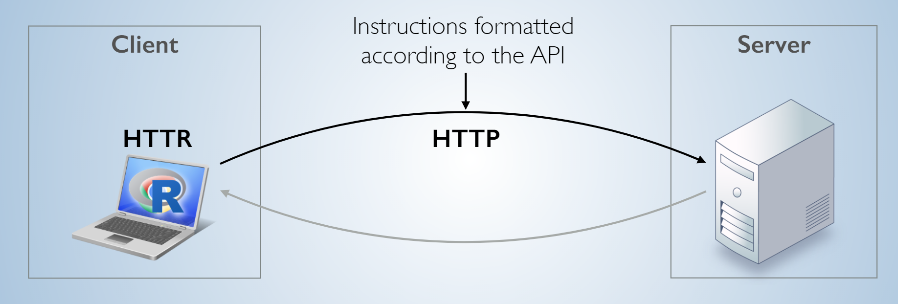
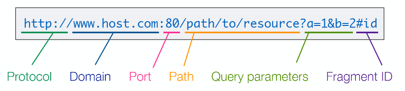
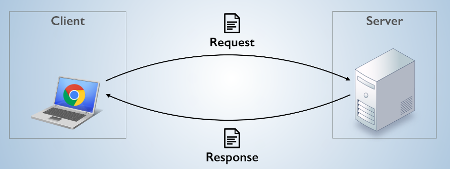
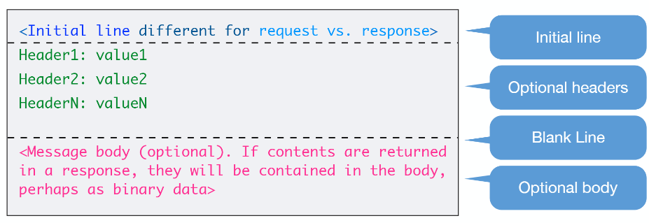
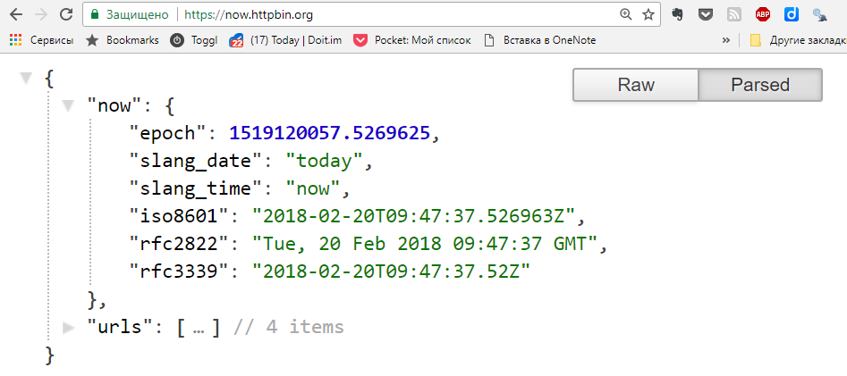
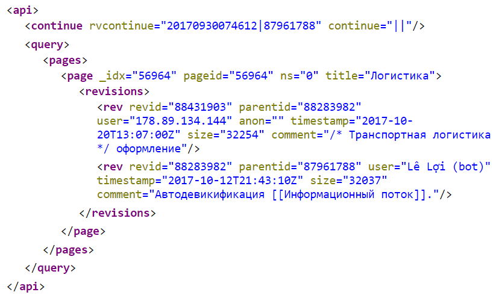

```{r setup, include=FALSE}
knitr::opts_chunk$set(echo = TRUE)
```


```{r, message=F, warning=F}
library(httr) # Запросы к веб-серверам
library(tidyverse) # Манипулирование данными
library(lubridate) # Обработка дат
library(jsonlite) # Обработка JSON
library(xml2) # Обработка XML
```


# Введение

Многие веб-сайты публикуют интересные данные, которую можно использовать при разработке аналитических решений. Для автоматического получения этих данных можно использовать R и пакеты для него.

Возможны несколько ситуаций:

  1. Данные предоставляются сайтом **в виде файлов (текст, Excel и др.)**, доступных по ссылке.  
  
  2. Данные можно загрузить при помощи **специализированного пакета для R**.
  
  3. Сайт **предоставляет данные через API**. Как получить их мы и рассмотрим в этом блокноте.  
  
  4. Данные содержатся на страницах сайта и их можно оттуда **извлечь при помощи HTTP-запросов и разбора HTML**. Эта тема будет рассмотрена позднее.
  
  5. Сайт **динамически добавляет данные на страницу при помощи JavaScript**. Для доступа к таким данным требуется эмулировать работу браузера и использовать специальные инструменты, например RSelenium. С работой этого инструмента можно познакомиться [здесь](https://ropensci.org/tutorials/rselenium_tutorial/).
  
  
# Загрузка файлов из Интернет
  
  Рассмотрим ситуацию, когда данные предоставляются сайтом **в виде файлов (текст, Excel и др.)**, доступных по ссылке.  
  
  В этом случае можно загрузить файл при помощи функции `download.file()` и работать с ним дальше локально. 
  
## Пример загрузки данных с портала data.mos.ru

В качестве примера загрузим данные о [расположении электрозаправок в Москве с портала data.mos.ru](https://data.mos.ru/opendata/7704786030-elektrozapravki). Сайт отдает данные в форматах csv, excel, json, в zip-архиве.

Загружаем файл на локальный диск.  
  
```{r Загрузка данных об электрозаправках}
# Ссылка на набор данных в формате 
url = 'https://op.mos.ru/EHDWSREST/catalog/export/get?id=254847'
# Имя локального файла:
local_file <- 'recharge_stations.zip'

# Загружаем файл с сайта, если локальный файл отсутствует
if (!file.exists(local_file)) {
  download.file(url, 
                destfile = local_file,
                mode = 'wb') #бинарный режим передачи!
}
```

Получаем имя файла с данными внутри архива:

```{r Имя файла данных в архиве}
# Получаем имя файла данных внутри архива
data_file <- 
  local_file %>% 
  unzip(list = TRUE) %>% # Список файлов в архиве 
  .$Name # Значение в столбце Name

data_file
```


Достаем данные из файла

```{r Получаем данные из файла в архиве, paged.print=TRUE}

# Загружаем данные из файла в архиве без распаковки
recharge <- 
  'recharge_stations.zip' %>%
  unz(filename = data_file) %>% 
  read_delim(
    delim = ';',
    locale = locale(encoding = 'windows-1251',
                    decimal_mark = '.')) %>%
  select(ID:Latitude_WGS84)

recharge  %>% head() %>% knitr::kable()
```

Данные можно отобразить на карте при помощи пакета [leaflet](https://rstudio.github.io/leaflet/map_widget.html).

```{r Визуализация на карте}
library(leaflet)
m <- leaflet(recharge) %>%
  addTiles() %>%
  addMarkers(lng = ~Longitude_WGS84,
             lat = ~Latitude_WGS84,
             popup = ~Name)
m
```


## Считывание данных по URL напрямую

Многие функции R, например `read_csv()`, умеют загружать удаленные данные напрямую, используя URL.

Загрузим, в качестве примера, [данные из репозитория НИСа на GitHub](https://github.com/postlogist/research-seminar/tree/master/time-series/data).

```{r Загрузка данных по URL, paged.print=TRUE}

url <- 'https://raw.githubusercontent.com/postlogist/research-seminar/master/time-series/data/babies.tsv'

remote_data <- read_tsv(url)

head(remote_data) %>% knitr::kable()
```

Чтобы не загружать данные при каждом запуске блокнота, рекомендуем кэшировать их локально, используя функции `writeRDS()` и `readRDS()`. Алгоритм действий такой:

1) Проверить, нет ли копии данных в локальном файле (e.g. `mydata.RDS`)  
2) Если есть, то загрузить данные из файла `mydata.RDS`. 

3) Если нет, то загрузить данные по URL и сохранить их в локальном файле `mydata.RDS`


# Загрузка данных при помощи специализированных пакетов

Для многих онлайн-источников данных разработаны пакеты, облегчающие работу с ними на R. 

Примеры таких пакетов:

  - `sophisthse`, `quantmod` - для получения данных [экономических временных рядов](https://rawgit.com/postlogist/research-seminar/master/time-series/decomposition.html)
  
  - `gtrends` - для получения [трендов поисковых запросов](https://rawgit.com/postlogist/research-seminar/master/r-bootcamp/gtrendsanalysis.html)

С внушительным списком специализированных пакетов можно ознакомиться на странице проекта [CRAN Task View: Web Technologies](https://cran.r-project.org/view=WebTechnologies), в разделе Web Services.


# Получение данных из веб API

## Понятие веб API

Статические данные в виде файлов сегодня используются в Интернет все реже, поскольку это неэффективно: при любом изменении данных необходимо пересоздавать и загружать повторно весь файл. Более удобный способ получения информации - через API.

**API (Application Programming Interface)** - интерфейс программирования приложений - это набор инструкций и соглашений о том, как одна программа должна взаимодействовать с другой.

Применительно к Интернет, взаимодействие с API напоминает просмотр сайтов в браузере, однако между навигации по ссылкам "вручную" используются запросы, которые формируются и обрабатываются программой.

При помощи API можно создавать запросы к данным, размещенным на сайте, и отбирать их по различным критериям, минимизируя передачу "лишних" данных по сети. Данные возвращаются в машиночитаемом формате, их легко обрабатывать.



## Протокол HTTP

Чтобы обратиться к нужному ресурсу в Интернет, требуется указать его адрес - **URL (Uniform Resource Locator)**:




Для доступа к веб API используется такой же протокол, как и для просмотра веб-страниц - **HTTP (hypertext transfer protocol)**. Взаимодействие с ресурсом - это диалог **клиента** и **сервера**, в котором клиент объясняет, что он хочет получить при помощи **запросов** (request) нескольких типов. Сервер дает **ответ** (response) на запрос, который сообщает о результатах и содержит запрошенные данные.



Сообщения, пересылаемые между клиентом и сервером, имеют одинаковую структуру:

 - Первая строка (версия протокола и адрес ресурса, или статус ответа)  
 - Заголовки  
 - Тело сообщения (может отсутствовать)




Пример взаимодействия с веб-ресурсом

```{r Пример взаимодействия с веб-ресурсом}
GET('https://www.hse.ru/', verbose())
```

Для указания желаемого действия клиент использует определенный **метод запроса**. Для сбора данных наиболее важны следующие методы:

 - `GET` - получение указанного ресурса с сервера,  
 - `POST` - отправка на сервер некоторого объекта (файл, данные формы и др.)


## Использование пакета httr для взаимодействия с веб-ресурсами

В R наиболее удобным средством для работы с веб-ресурсами, в т.ч. API является пакет `httr`. В этом пакете содержатся функции для выполнения запросов и обработки ответа сервера. Каждому методу запроса в `httr` соответствует своя функция-глагол - `GET()`, `POST()` и т.д.

Функция `GET()` позволяет получить ресурс по указанному адресу:

```{r Получение данных при помощи GET}
response <- GET(url = "http://httpbin.org/get")

response
```

Полезную часть ответа - **содержимое** (content) - можно извлечь из ответа функцией `content()`:

```{r}
content(response)
```

В данном случае функция `GET()` автоматически преобразовала ответ в формат списка R.


Для отправки данных на сервер используется функция `POST()`:

```{r Пример POST}
post_response <- POST(url = 'https://httpbin.org/post',
                      body = 'Test request')

post_response
```

## Коды состояния и обработка ошибок

При автоматизированной обработке результатов запроса важно проверять, успешно ли завершился запрос. В ответе сервера содержится информация о **коде состояния** (status) запроса, которую можно получить при помощи функции `http_status()` или напрямую:

Извлечение кода состояния запроса:

```{r Как получить код состояния из результата запроса}
http_status(response)
response$status_code
```

Кодов состояний существует довольно [много](https://ru.wikipedia.org/wiki/%D0%A1%D0%BF%D0%B8%D1%81%D0%BE%D0%BA_%D0%BA%D0%BE%D0%B4%D0%BE%D0%B2_%D1%81%D0%BE%D1%81%D1%82%D0%BE%D1%8F%D0%BD%D0%B8%D1%8F_HTTP)

Упрощенно, можно выделить 4 категории кодов состояний:

- 2xx - успешное завершение
- 3xx - успешное завершение, произошло перенаправление
- 4xx - ошибка на стороне клиента (неправильный запрос, нет ресурса, нет доступа к ресурсу,...)
- 5xx - ошибка на стороне сервера


При анализе результатов запроса удобно пользоваться функцией `http_error()`, которая проверяет наличие ошибок при выполнении запроса:

```{r Обработка ошибок выполнения запроса}

url <- 'https://google.com/bad_url/'
#url <- 'https://google.com/'

response <- GET(url)

if(http_error(response)) {
  warning('Request has failed\n')
} else {
  content(response)
}
http_status(response)
```

Помимо функции `warning()`, выводящей предупреждение, можно использовать функцию `stop()`, которая остановит выполнение программы с сообщением об ошибке.


## Формирование запросов

При доступе к API в адрес URL включаются **параметры** запроса. Существует два стиля передачи параметров (зависит от API):

- С помощью директорий:  
`http://website.com/api/value1/value2`

- С помощью параметров запроса:  
`http://website.com/api.php?param1=value1&param2=value2`


Для иллюстрации работы с API первого типа получим данные из [Star Wars API](https://swapi.co/). URL-адрес для запроса "склеивается" из базового адреса для доступа к API и параметров при помощи функции `paste()`

```{r Получение данных из API с директориями}
swapi_endpoint <- 'https://swapi.co/api'

url <- paste(swapi_endpoint, 'starships', 9, sep = '/' )

result <- GET(url)
result
content(result)

```

Запросы с параметрами удобно передавать параметры через аргумент `query=` функции `GET()`. Там необходимо передать именованный список, элементами которого являются пары `параметр=значение`.

В качестве примера, обратимся к API для тестирования запросов:

```{r Получение данных из API с параметрами}
httpbin_endpoint <- 'https://httpbin.org/get'
query_params <- list(one = 'First Parameter', 
                     two = 2)

GET(httpbin_endpoint, query = query_params)
```


# Формат данных JSON

**JSON (JavaScript Object Notation)** - это популярный формат данных, который часто используется веб API.

Это простой текстовый формат, в котором данные хранятся в виде вложенных (иерархических) структур. Основными компонентами являются:

  - **объекты**: {"property1" : value1, "property2" : value2}  
  - **массивы**: [object1, object2]
  
Значениями могут быть: "строки", числа, логические значения, null, а также вложенные объекты и массивы.

Пример JSON:

```{JSON}
{
	"title": "A New Hope",
	"episode_id": 4,
	"opening_crawl": "It is a period of civil war.\r\nRebel spaceships, striking\r\nfrom a hidden base, have won\r\ntheir first victory against\r\nthe evil Galactic Empire.\r\n\r\nDuring the battle, Rebel\r\nspies managed to steal secret\r\nplans to the Empire's\r\nultimate weapon, the DEATH\r\nSTAR, an armored space\r\nstation with enough power\r\nto destroy an entire planet.\r\n\r\nPursued by the Empire's\r\nsinister agents, Princess\r\nLeia races home aboard her\r\nstarship, custodian of the\r\nstolen plans that can save her\r\npeople and restore\r\nfreedom to the galaxy....",
	"director": "George Lucas",
	"producer": "Gary Kurtz, Rick McCallum",
	"release_date": "1977-05-25",
	"characters": [
		"https://swapi.co/api/people/1/",
		"https://swapi.co/api/people/2/",
		"https://swapi.co/api/people/3/",
		"https://swapi.co/api/people/4/",
		"https://swapi.co/api/people/5/",
		"https://swapi.co/api/people/6/",
		"https://swapi.co/api/people/7/",
		"https://swapi.co/api/people/8/",
		"https://swapi.co/api/people/9/",
		"https://swapi.co/api/people/10/",
		"https://swapi.co/api/people/12/",
		"https://swapi.co/api/people/13/",
		"https://swapi.co/api/people/14/",
		"https://swapi.co/api/people/15/",
		"https://swapi.co/api/people/16/",
		"https://swapi.co/api/people/18/",
		"https://swapi.co/api/people/19/",
		"https://swapi.co/api/people/81/"
	],
	"planets": [
		"https://swapi.co/api/planets/2/",
		"https://swapi.co/api/planets/3/",
		"https://swapi.co/api/planets/1/"
	],
	"starships": [
		"https://swapi.co/api/starships/2/",
		"https://swapi.co/api/starships/3/",
		"https://swapi.co/api/starships/5/",
		"https://swapi.co/api/starships/9/",
		"https://swapi.co/api/starships/10/",
		"https://swapi.co/api/starships/11/",
		"https://swapi.co/api/starships/12/",
		"https://swapi.co/api/starships/13/"
	],
	"vehicles": [
		"https://swapi.co/api/vehicles/4/",
		"https://swapi.co/api/vehicles/6/",
		"https://swapi.co/api/vehicles/7/",
		"https://swapi.co/api/vehicles/8/"
	],
	"species": [
		"https://swapi.co/api/species/5/",
		"https://swapi.co/api/species/3/",
		"https://swapi.co/api/species/2/",
		"https://swapi.co/api/species/1/",
		"https://swapi.co/api/species/4/"
	],
	"created": "2014-12-10T14:23:31.880000Z",
	"edited": "2015-04-11T09:46:52.774897Z",
	"url": "https://swapi.co/api/films/1/"
}
```


При автоматизированой обработке можно понять, что используется ответ в формате JSON при помощи функции `http_type()`:

```{r Определение формата содержимого ответа}
http_type(result)
```

Однако этот признак ответа не всегда заполняется сервером корректно, поэтому может потребоваться визуальная проверка структуры содержимого ответа. По умолчанию функция `content()` преобразует данные в структуры R, поэтому чтобы получить исходное представление, необходимо указать параметр `as = 'text'`:

```{r}
result %>% content(as = 'text') %>% writeLines()
```

**Примечание:** функция `writeLines()` используется для удаления служебных символов и упрощения текста.

Браузеры также могут отображать JSON. Для увеличения наглядности можно использовать расширения (для Chrome - JSON Formatter, JSON Viewer, JSONView).


Например, так выглядят в Chrome данные из API: https://now.httpbin.org/



## Преобразование JSON в табличные данные

Содержимое ответа в формате JSON автоматически преобразуется в объект R (список) функцией `content()`. Иногда необходимо контролировать этот процесс, в этом случае можно отключить преобразование (`as = 'text'`) и преобразовать данные функцией `jsonline::fromJSON()`:


```{r}
films_result <- 
  paste(swapi_endpoint, 'films', sep = '/') %>%
  GET() %>%
  content(as = 'text', encoding = 'utf-8')

films_parsed <- films_result %>% fromJSON()

class(films_parsed)
str(films_parsed, max.level = 1)
```

Обратим внимание, что по умолчанию функция `fromJSON()` упрощает структуру данных, преобразуя подходящие по структуре части списка в векторы или таблицы. Так мы сразу можем получить данные о фильмах в удобном для работы табличном виде:

```{r paged.print=TRUE}
films_parsed$results %>%
  select(title, director, release_date) %>%
  arrange(release_date) %>% 
  knitr::kable()
```

Если это нежелательно, то можно отключить автоматическое упрощение:

```{r}
films_result %>% 
  fromJSON(simplifyDataFrame = FALSE) %>% 
  str(max.level = 1)
```

Теперь результат - это список.


## Манипулирование данными, полученными в запросе

Как правило, необходимо использовать лишь часть данных, возвращенных запросом. Наиболее простой способ выбрать нужное - преобразовать данные в таблицу и использовать функции пакета `dplyr`.

В качестве примера, рассмотрим получение и обработку данных о количестве просмотров страниц Википедии. Документация на API доступна по ссылке: https://wikimedia.org/api/rest_v1/ 


Работу лучше разбить на несколько логических блоков, оформленных как функции:

1. Получение данных из API
2. Преобразование данных в таблицу нужной структуры

```{r}
# Функция для получения данных в формате JSON:
get_pageviews <- function(title, # title - название статьи
                          first = # начальная дата периода выборки в формате: yyyymmdd 
                            format(Sys.Date() - days(7), '%Y%m%d'), 
                          last = # колнечная дата периода выборки в формате: yyyymmdd 
                            format(Sys.Date(), '%Y%m%d')) 
                          
{
  
  
  # Формируем запрос:
    endpoint <- 'https://wikimedia.org/api/rest_v1'
    operation <- 'metrics/pageviews/per-article/ru.wikipedia/all-access/all-agents'
    first <- paste0(first, '00')
    last <- paste0(last, '00')
    
    url <- paste(endpoint, operation,
                  title, 
                  'daily', first, last, sep = "/")
    
  # Получаем данные и проверям ошибки:
    result <- GET(url)
    
    if (http_error(result)) {
      print(http_status(result))
      stop('Request has failed\n')
      
    } else {
      content(result, as = 'text')
    }
}
```

Тестируем  функцию - получим данные за первую неделю февраля:

```{r paged.print=TRUE}
# Тестируем
get_pageviews('Логистика', 20180201, 20180207) %>% 
  fromJSON() %>%
  knitr::kable()
  
# get_pageviews('Логистикаааа', 2018020100, 2018020700) #ошибка
```


Данные возвращены в виде объекта, в свойстве "items" находится массив записей о просмотрах. Для преобразования их в таблицу нужной структуры, напишем еще одну функцию:


```{r}
# Функция для преобразования в таблицу
pageviews_to_df <- function(data) {
  data %>%
    fromJSON(simplifyDataFrame = TRUE) %>%
    .$items %>% #достаем таблицу из элемента items
    mutate(date = ymd(str_sub(timestamp, end = -3))) %>%
    select(project, article, date, views) %>%
    mutate(week = floor_date(date, unit = 'week', week_start = 1),
           month = floor_date(date, unit = 'month'))
}
```

Пробуем функцию

```{r paged.print=TRUE}
df_log <- 
  get_pageviews('Логистика', 20150101, 20180131) %>%
  pageviews_to_df()

head(df_log) %>% knitr::kable()
```

```{r}
df_ml <- 
  get_pageviews('Машинное обучение', 20150101, 20180131) %>%
  pageviews_to_df()
head(df_ml) %>% knitr::kable()
```

Сравним количество просмотров на графике:

```{r}
rbind(df_log, df_ml) %>%
  group_by(article, month) %>%
  summarize(views = sum(views)) %>%
  
  ggplot(aes(x = month, y = views, color = article)) +
  geom_line() +
  labs(title = "Количество просмотров страницы в Википедии за месяц",
       x = NULL, y = NULL, 
       color = 'Статья')
```


Другим способом обработки результатов является использование списков непосредственно. В R имеется пакет `rlist`, позволяющий извлекать элементы списков, подобно извлечению столбцов из таблицы.

```{r Загрузка пакета rlist}
#install.packages("rlist") # установите пакет при необходимости
library(rlist)
```

Получим данные в виде списка

```{r}
list_log <- 
  get_pageviews('Логистика', 20180201, 20180203) %>% 
  fromJSON(simplifyDataFrame = FALSE) %>%
  .$items # данные находятся в элементе items


list_log[1]
```

Мы получили в результате нумерованный список, элементами которого являются вложенные именованные списки, в которых хранятся значения атрибутов записи о количестве просмотров: `project`, `article`, `granularity`, `timestamp`, `access`, `agent`, `views`. 

Пусть необходимо получить только 3 атрибута - название, дату и число просмотров. Выберем их при помощи функции `rlist::list.select()`:

```{r}
list_log %>%
  list.select(article, timestamp, views) %>%
  .[1]
```

В дальнейшем можно преобразовать упрощенный список в таблицу:

```{r paged.print=TRUE}
# Через rlist::list.stack()
list_log %>%
  list.select(article, timestamp, views) %>%
  list.stack() %>% knitr::kable()

# Через dplyr::bind_rows()
list_log %>%
  list.select(article, timestamp, views) %>%
  bind_rows() %>% knitr::kable()
```


# Этикет использования API

Автоматизированная отправка запросов может создавать высокую нагрузку на сервер, лишая пользователей доступа к его ресурсам. По этой причине владельцы API устанавливают определенные правила его использования. Правила регламентируют частоту запросов, их количество за период, условия использования данных, идентификацию пользователя и т.п.

Правила описаны в документации на API, например:

 - [Общая информация об API Mediawiki](https://www.mediawiki.org/wiki/API:Main_page/ru) - см. раздел: Этикет использования API
 - https://www.mediawiki.org/wiki/API:Etiquette
 - https://tech.yandex.ru/maps/commercial/


## Аутентификация

Многие API используют коды доступа (access tokens), для получения которых необходимо пройти регистрацию и передать владельцам свою контактную информацию.


## User Agent
Даже если API не требует регистрации, часто требуется предоставлять информацию о характере и назначении запросов в самом запросе. Для этого в HTTP запрос включается строка [`User Agent` (идентификация клиентского приложения)](https://ru.wikipedia.org/wiki/User_agent). 

Часто среди требований присутствуют: включение контактного email, названия приложения, целей отправки запросов.

Сервер может по-разному обрабатывать запросы в зависимости от значения User Agent, например не соответствующие требованиям запросы могут блокироваться.

В `httr` для управления содержимым User Agent в запросе используется функция `user_agent()`

```{r}
GET(httpbin_endpoint, 
    user_agent(paste('me@email.com', 
                     'Test request from R/httr')))
```

## Ограничение частоты запросов

Многие API устанавливают минимальное время между запросами или максимальную их частоту за период. Чтобы не превысить эти пределы, необходимо добавлять паузы между отправкой запросов в цикле. Например, если ограничение составляет 20 запросов в минуту, то минимальный интервал между запросами должен быть 3 секунды.

Задержку можно добавить при помощи функции `sys.sleep()`:

```{r, eval=FALSE}
for (url in urls) {
  result <- GET(...)
  sys.sleep(3) # задержка
}
```


# Формат данных XML

Вторым распространенным форматом данных для работы с API является **XML (eXtenstible Markup Language)** - расширяемый язык разметки. Как и JSON, это текстовый формат с иерархической структурой. Однако, в отличие от универсальной и простой структуры JSON, включающей только объекты и массивы, в XML данные структурируются при помощи вложенных тегов.

## Структура XML-документа

Документ XML содержит 2 типа элементов - **разметку** (markup), которая задает структуру и **содержимое** (content).

В качестве примера, рассмотрим XML-документ с историей изменения страниц, который возвращает API Википедии [пример](https://ru.wikipedia.org/w/api.php?action=query&titles=%D0%9B%D0%BE%D0%B3%D0%B8%D1%81%D1%82%D0%B8%D0%BA%D0%B0&prop=revisions&format=xml&rvprop=ids%7Cuser%7Ctimestamp%7Csize%7Ccomment&rvlimit=2).


**Совет:** для удобного просмотра XML в Chrome установите расширение `XML Tree`.




Для разметки XML-документа используются **теги** (tags). Существуют **парные теги**: `<тег> ... </тег>`, состоящие из **открывающего** `<...>` и **закрывающего** `</...>` тегов, а также **одиночные теги**: `<тег/>`.

В этом примере используются парные теги: `api`, `query`, `pages`, `page`, `revisions` и одиночный тег: `rev`.

У тегов могут быть **атрибуты**, которые записываются как пары `атрибут = "значение"` после имени открывающего тега. 

Например, у тега `page` есть атрибуты: `_idx`, `pageid`, `ns` и `title`.

Между открывающим и закрывающим тегами помещаются **вложенные теги** или текст (**содержимое тега**). В нашем примере нет тегов с содержимым, вся информация представлена в атрибутах. Приведем пример тега с содержимым:

```xml
<items>
  <item>Товар А</item>
  <item>Товар Б</item>
</items>
```

Каких-либо жестких правил, куда следует помещать данные нет, однако часто используют подход, в котором данные находятся в содержимом тегов, а атрибуты несут вспомогательную, справочную информацию (метаданные).

При работе с XML главное - понимать его иерархическую структуру. **Элемент XML** (XML element) - это все, что начинается с открывающего и заканчивается закрывающим тегом (включая сами теги). Таким образом, элементы XML часто содержат вложенные элементы. Например, элемент `revisions` содержит два вложенных элемента `rev`:


Аналогично, элемент `api` содержит вложенные элементы `continue` и `query` (последний также содержит вложенные элементы).

Структуру XML-документа можно представить себе как дерево, в котором узлы - это элементы:

```
api
|--continue
|--query
   |--pages
      |--page
         |--revisions
            |--rev
            |--rev
```

Отношения между элементами напоминают отношения между родственниками в семье. Например, элементы `continue` и `query` являются **потомками** (child) элемента `api`. Элемент `api` является для них **родительским** (parent). 

Элементы `continue` и `query` имеют одного родителя и являются **одноуровневыми**, или  "братьями" (**siblings**). Еще один пример одноуровневых элементов - `rev`.


## Обработка XML-документов в R

### Получение объекта xml_document

Для работы с XML-данными в R есть пакет `xml2`. Подключим его:

```{r}
library(xml2)
```

Рекомендуем ознакомитсья с [руководством](https://cran.r-project.org/web/packages/xml2/index.html) по пакету.


В качестве примера, будем работать с данными из API Википедии, документация на который представлена [здесь](https://www.mediawiki.org/wiki/API:Main_page/ru#Формат).

Мы подготовили функцию для загрузки данных о правках статей Википедии.
API использует стиль передачи параметров запроса через параметры, поэтому мы используем аргумент `query` функции `GET()`, чтобы задать их.


```{r}
# Функция возвращает историю правок страницы Википедии
get_revisions <- function(article_title,  # Название статьи
                          format = "xml", # Формат ответа -  xml или json
                          max_revisions = 5) # Количество последних правок
{
  
  result <- GET(url = 'https://ru.wikipedia.org/w/api.php',
                  query = list(action = "query",
                               titles = article_title,
                               prop = "revisions",
                               format = format,
                               rvprop = 'ids|user|timestamp|size|comment',
                               rvlimit = max_revisions))
 if (http_error(result)) {
   warning("Query has failed\n")
   http_status(result)
 } else {
   result
 }
}

```

Получим данные о 5 последних правках статьи "Логистика":

```{r}
response <-  get_revisions('Логистика', max_revisions = 5)
```


Проверить тип ответа (на основе заголовков), можно при помощи функции `http_type()`:
```{r}
response %>% http_type()
```


Обработав ответ функцией `content()`, можно получить содержимое в виде объекта `xml_document`. 

```{r}
res_xml <- response %>% content()

res_xml
```


Вместо автоматического преобразования содержимого ответа, можно извлечь его в виде текста (параметр `as = 'text'` в функции `content()`) и затем преобразовать в `xml_document` функцией `xml2::read_xml()`.


Поскольку структура XML громоздкая, удобно выводить ее в сжатой форме, используя функцию `xml_structure()`.


```{r}
res_xml %>% xml_structure()
```

Функция выводит только дерево тегов с указанием их атрибутов, но без содержимого. 


### Извлечение элементов с помощью XPATH

Для извлечения элементов из XML документа используется язык XPATH, который позволяет выбрать нужный элемент. Чтобы извлечь этот элемент из документа, используются функции `xml2::xml_find_all()`, `xml2::xml_find_first()`.


Например, извлечь первый элемент `rev` из документа можно командой:

```{r}
res_xml %>% xml_find_first(xpath = '/api/query/pages/page/revisions/rev')

```

Путь к элементу напоминает путь к файлу в дереве каталогов на диске. В данном случае путь получился длинным, поэтому можно использовать сокращенную запись: `//rev`. Этому выражению будут соответствовать все элементы `rev` на любом уровне вложенности. 

Получим таким образом все загруженные правки статьи:

```{r}
revs <- res_xml %>% xml_find_all(xpath = '//rev')
revs
```

Мы получили правки в виде специального объекта - `xml_nodeset`. 

Если бы данные в нашем примере находились в содержимом тега `rev`, то их можно было бы получить при помощи функций `xml_text()`, `xml_double()`, `xml_integer()` или преобразовать в список `as_list()`.

```{r}
revs %>% xml_text()
```

В данном случае полезные сведения находятся в атрибутах тега, поэтому с ними необходимо работать при помощи функций для работы с атрибутами: `xml_attr()` (извлекает один атрибут) или `xml_attrs()` (извлекает все атрибуты).

Рассмотрим работу `xml_attrs()` на примере первого элемента `rev`:

```{r}
res_xml %>% 
  xml_find_first(xpath = '//rev') %>%
  xml_attrs()
```

Мы получили вектор с именованными элементами, который содержит значения всех атрибутов.

Если применить функцию `xml_attrs()`, то получим список, элементами которого являются аналогичные векторы со значениями атрибутов для каждого узла в наборе.

```{r}

revs_list <- revs %>% xml_attrs()
  
revs_list %>% class()

```

Рассмотрим первые два элемента списка:

```{r}
revs_list[1:2]

```

Как видно из примера, для разных узлов количество атрибутов отличается. В первом элементе был атрибут `anon`, а во втором его нет.
По этой причине преобразовать результаты в таблицу не получится: отсутствуют значения некоторых столбцов для некоторых узлов.

Проблему можно решить, если сначала отобрать только те атрибуты, которые присутствуют во всех узлах. Для этого можно использовать функцию `rlist::list.select()`:

```{r paged.print=TRUE}
revs_list %>%
  list.select(revid, user, timestamp, size, comment) %>%
  bind_rows() %>% 
  knitr::kable()
```


Другой способ получения таблицы заключается в извлечении каждого атрибута в отдельности в виде вектора и "склеивании" полученных векторов в одну таблицу:

```{r}
revids <- revs %>% xml_attr('revid')
users <- revs %>% xml_attr('user')

tibble(revid = revids, user = users) %>% 
  knitr::kable()

```


При помощи XPATH можно извлекать не только элементы, но и атрибуты. Для этого используется выражение: `//тег/@атрибут`.

В качестве примера, получим значения атрибута `revid` всех элементов `rev`:

```{r}
revids2 <- res_xml %>% xml_find_all('//rev/@revid')
revids2
```


В этом случае также получаем набор узлов. Его можно преобразовать в вектор, при помощи функций `xml_text()`, `xml_integer()` и т.п.

```{r}
revids2 %>% xml_integer()

res_xml %>% xml_find_all('//@revid')
```


| Выражение  | Назначение                             | Примеры  
-------------|----------------------------------------|-----------------------:
`/путь`      | Элементы на заданном уровне            | `/api/continue`
`//путь`     | Элементы на заданном уровне или глубже | `//rev`, `//revs/rev`
`@атрибут`   | Атрибут                                | `//rev@revid`, `//@revid`
:Таблица XPATH выражений для извлечения элементов


Создадим функцию для преобразования XML-ответа API в таблицу данных.


```{r}
parse_revisions <- function(revisions_xml) {
  
  revisions_xml %>%
    xml_find_all(xpath = '//rev') %>%
    xml_attrs() %>%
    list.select(revid, timestamp, user, comment) %>%
    bind_rows() %>%
    mutate(timestamp = readr::parse_datetime(timestamp))
  
}

```


```{r paged.print=TRUE}
revisions_tbl_500 <- 
  get_revisions('Логистика', max_revisions = 500) %>%
  content() %>%
  parse_revisions()

revisions_tbl_500 %>% head() %>% knitr::kable()
```

Рассмотрим распределение правок по времени суток:

```{r}
revisions_by_hours <- 
  revisions_tbl_500 %>%
  mutate(hour = hour(timestamp)) %>%
  group_by(hour) %>%
  summarize(revcount = n()) %>%
  arrange(hour)

revisions_by_hours %>%
  ggplot() +
  geom_bar(aes(x = hour, y = revcount), stat = 'identity') +
  labs(title = 'Количество правок статьи "Логистика" в Википедии',
       x = 'Час', y = 'Количество правок')
```


# Ресурсы

 - [Виньетка пакета `httr`](https://cran.r-project.org/web/packages/httr/vignettes/quickstart.html)
 
 - [Виньетка пакета `jsonlite`](https://cran.r-project.org/web/packages/jsonlite/vignettes/json-aaquickstart.html)
 
 - Вебинар [Extracting Data from the Web, part 1](https://www.rstudio.com/resources/webinars/extracting-data-from-the-web-part-1/)
 
 - Вебинар [Using Web APIs from R](https://www.rstudio.com/resources/videos/using-web-apis-from-r/)
 
 - Инструменты для работы с веб-службами в R [Cran Task View: Web Technologies and Services](https://cran.r-project.org/view=WebTechnologies)
 
 - Список открытых API - [Public APIs](https://github.com/toddmotto/public-apis)
 
 - Пример использования R для анализа зарплат на основе API headhunter на Хабре: 
 [Простой WebScraping на R через API hh.ru](https://habrahabr.ru/post/337684/)
 
 - Расширения для Chrome для удобного просмотра JSON и XML: JSONView, XML Tree.
 
 - [Обучающее руководство по работе с пакетом rlist](https://renkun-ken.github.io/rlist-tutorial/)
 
 