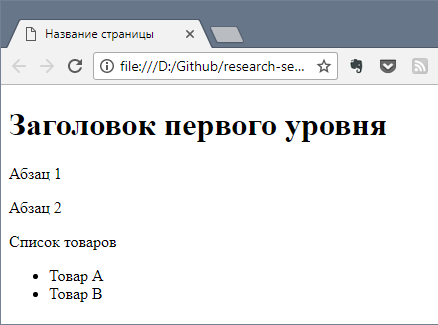
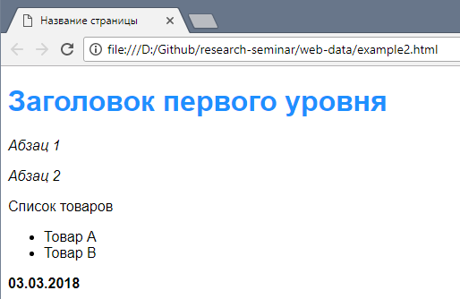
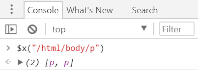
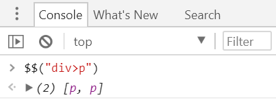
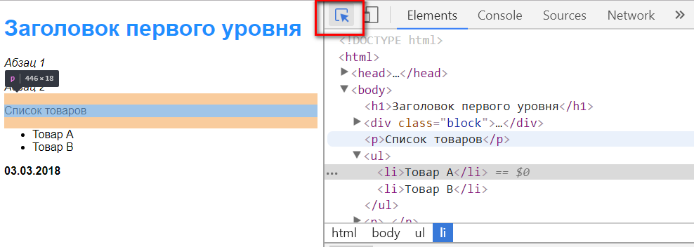
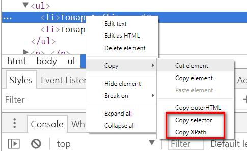
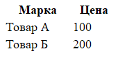
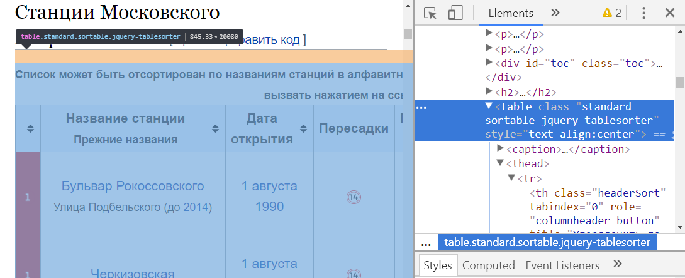

```{r setup, include=FALSE}
knitr::opts_chunk$set(echo = TRUE)
```


```{r, message=F, warning=F}
#library(httr) # Запросы к веб-серверам
library(tidyverse) # Манипулирование данными
library(lubridate) # Обработка дат
library(xml2) # Обработка XML
library(rvest) # Обработка HTML-страниц
library(stringr) # Обработка текстовых строк
```


# Введение

Часто сайты, содержащие полезную информацию, не предоставляют доступа к ней через API. В этом случае нужные данные можно попытаться "добыть" путем извлечения их непосредственно из веб-страницы. Процесс разбора веб-страниц и извлечения содержащихся на странице данных называется **веб-скрейпинг** (**web scraping**) - буквально, "соскребание" данных. В этом блокноте вы познакомитесь с примерами скрейпинга данных при помощи R и пакетов для него - `rvest`, `httr`, `xml2`. 

Как правило, необходимо собрать данные сразу с большого количества страниц, связанных гиперссылками. Поэтому требуется решить еще одну смежную задачу: выполнить **автоматизированный обход** страниц по гиперссылкам (**web crawling**). В R есть инструменты, помогающие решить и эту задачу, однако в данном блокноте мы их рассматривать не будем. В качестве примера одного из таких инструментов можно привести [пакет `Rcrawler`](https://cran.r-project.org/package=Rcrawler).

Для того, чтобы извлечь данные с веб-страницы, необходимо:

  1. Проанализировать структуру страницы (HTML) и выяснить, где в этой структуре находятся нужные данные и как к ним обратиться.

  2. Загрузить веб-страницу в R.

  3. Написать код для извлечения нужных данных, используя информацию об их "координатах" на странице (результат шага 1).


# Анализ структуры веб-страницы

## Как устроена веб-страница (HTML)

Веб-страницы создаются при помощи HTML (Hypertext Markup Language) - языка для разметки гипертекста. HTML-страница представляет собой текстовый файл, содержщащий вложенные теги (дерево тегов). Языки HTML и XML имеют много общего, однако у них разное целевое назначение. XML создавался для обмена данными между комьютерами и содержит расширяемый набор тегов для хранения различных элементов данных. В то же время HTML создан для форматирования текстов, которые будет читать человек. Его набор тегов фиксирован и большинство их предназначены именно для определения формата текста.

Вторым распространенным форматом данных для работы с API является **XML (eXtenstible Markup Language)** - расширяемый язык разметки. Как и JSON, это текстовый формат с иерархической структурой. Однако, в отличие от универсальной и простой структуры JSON, включающей только объекты и массивы, в XML данные структурируются при помощи вложенных тегов. 

С точки зрения обработки в R также много аналогий, поэтому рекомендуем вам предварительно ознакомиться с разделом про работу с XML блокнота по API.

Рассмотрим пример простого [документа](example1.html):

```html
<!DOCTYPE HTML>
<html>
  <head>
  	<title>Название страницы</title>
  	<meta charset="utf-8" />
  </head>
  <body>
  	<h1>Заголовок первого уровня</h1>
  	<p>Абзац 1</p>
  	<p>Абзац 2</p>
  	<p>Список товаров</p>
  	<ul>
  		<li>Товар A</li>
  		<li>Товар B</li>
  	</ul>
  </body>
</html>
```

Для разметки HTML-документа используются **теги** (tags). Существуют **парные теги**: `<тег> ... </тег>`, состоящие из **открывающего** `<...>` и **закрывающего** `</...>` тегов, а также **одиночные теги**: `<тег/>`.

Корневым элементом документа является парный тег `html`. В него вложены два парных тега - `head` и `body`. Тег `head` задает раздел **заголовка** (header) документа (обычно здесь хранятся название, кодировка документа и другие метаданные). Тег `body` содержит тело документа, его основное содержание.

Для описания стуктуры и форматирования документа используется множество тегов, с которыми можно познакомиться [здесь](http://htmlbook.ru/html). В нашем пример используются теги `h1` (заголовок), `p` (абзац), `ul` и `li` (маркированный список).

У тегов могут быть **атрибуты**, которые записываются как пары `атрибут = "значение"` после имени открывающего тега. В нашем примере тег `meta` содержит атрибут `charset`, который позволяет указать кодировку символов в тексте страницы.

Браузер отображает веб-страницу в отформатированном виде на основе этих тегов.



## CSS

Как мы видим, оформление страницы получилось весьма скромным. Хотя в HTML есть способы задавать оформление при помощи тегов и их атрибутов, в современном Интернет используется другой подход. Вместо того, чтобы включать теги для форматирования непосредственно в сам HTML-документ, используется отдельный механизм - **CSS** (Cascaded Style Sheets), [каскадные таблицы стилей](https://ru.wikipedia.org/wiki/CSS). 

Таблицы стилей CSS могут размещаться в отдельных файлах или встраиваться в HTML-документ. Их использование позволяет гибко менять оформление страниц без редактирования текста документа.


Основу CSS составляют **HTML-селекторы**, имена которых совпадают с тегами HTML. Селектор позволяет выбрать определенный фрагмент HTML-документа и задать для него стиль оформления. 

Например, можно перекрасить заголовки первого уровня в другой цвет, используя селектор `h1`:

```css
h1		{color: dodgerblue;}
```

Стили оформления могут наследоваться вложенными тегами. Например, задав шрифт для тега `body`, можно изменить начертание символов сразу во всем документе:

```css
body	{font-family: sans-serif;}
```

При использовании селекторов, совпадающих с тегами, оформление применяется ко всем элементам документа с такими тегами. Если необходимо изменить оформление лишь определенного фрагмента документа, то это можно реализовать, используя элементы `div` и `span`. Элемент `div` является блочным, т.е. он позволяет сгруппировать несколько абзацев в блок с единым оформлением:

```html
    ...
		<div class="block">
			<p>Абзац 1</p>
			<p>Абзац 2</p>
		</div>
		...
```

Элемент `span` является строчным. Он используется внутри абзаца, чтобы задать оформление фрагмента текста.

```html
  ...
  <p><span id="date">03.03.2018</span></p>
  ...
```

Для того, чтобы задать оформление для конкретного блока (или класса блоков) в CSS используются **идентификаторы** и **классы**. В предыдущем примере мы пометили блок `div` классом 'block' и задали идентификатор для `span`-элемента с датой изменения - `date`.

Теперь можно задать в таблице стилей оформление, используя введенные имена:

```css
			.block	{font-style: italic}
			#date	{font-weight: bold}
```

Классы и идентификаторы можно задавать не только для тегов `div` и `span`, но и для других элементов HTML. При этом классы создаются для обозначения однотипных элементов, у которых должно быть одинаковое оформление. Идентификаторы же нужны для указания конкретного, единственного на странице элемента. 

В результате применения таблицы стилей, отображение документа в браузере несколько улучшится:



С исходным кодом страницы можно познакомиться в файле [example2.html](example2.html)


## Как указать путь к элементу

Понимание структуры HTML документа, состоящей из вложенных тегов, а также системы классов и идентификаторов CSS, позволяет ссылаться на интересующие элементы в процессе веб-скрейпинга.


### XPath

Структуру HTML-документа можно представить себе как дерево, в котором узлы - это элементы:

```
html
|--head
|----title
|----meta
|----style
|--body
   |--h1
   |--div
   |  |--p
   |  |--p
   |
   |--p
   |--ul
      |--li
      |--li
   |--p
      |--span
```

Отношения между элементами напоминают отношения между родственниками в семье. Например, элементы `h1` и `div` являются **потомками** (child) элемента `body`. Элемент `body` является для них **родительским** (parent). 

Элементы `p`, вложенные в `div`, являются **одноуровневыми**, или  "братьями" (**siblings**). Еще один пример одноуровневых элементов - `li`, вложенные в `ul`, а также `title`, `meta` и `style`, вложенные в `head`.

**XPath**, или XML Path Language, - это язык, позволяющий ссылаться на элементы XML и HTML-документов в запросах, чтобы получить интересующую информацию. 

Чтобы извлечь нужный элемент, необходимо указать путь к нему от "корня" документа. Например, чтобы извлечь список, можно использовать такой путь: 

```
/html/body/ul
```

**Совет:** XPath-выражения удобно тестировать в консоли разработчика браузера. Инструменты разработчика в Chrome можно запустить через контекстное меню страницы (`Просмотреть код`). Чтобы выполнить запрос, необходимо ввести в консоли команду: 

```
$x("путь")
```




При помощи пути: 
```
/html/body/p
``` 

можно получить все абзацы, вложенные в `body`.

Чтобы извлечь только второй абзац, можно указать путь к нему так:

```
/html/body/p[2]
``` 

Одиночный слэш `/` в начале пути означает, что путь - **абсолютный**, т.е. ведет от корня документа. Во многих случаях использование абсолютных путей нежелательно. Помимо того, что их долго набирать, они чаще "ломаются", когда владельцы веб-сайта изменяют страницу.

Вместо абсолютных, можно использовать также **относительные** пути, которые начинаются с двойного слэша: `//`. 

Например, чтобы извлечь все элементы маркированного списка, можно использовать путь:

```
//li
```
Поиск выполняется следующим образом: сначала определяется "родитель" элемента `li` (т.е. `ul`), затем возвращаются все дочерние элементы `li` этого родителя.

Относительными путями нужно пользоваться с осторожностью, поскольку запросы с ними могут вернуть элементы совершенно разных родителей. Например, по запросу:

```
//p
```
в нашем примере будут возвращены 4 абзаца - два вложенных в `div` и два вложенных в `body`.

Необходимо уточнять относительный путь, добавляя в него дополнительные уровни. Например, если нас интересуют только абзацы, вложенные непосредственно в `body`, то уточненный путь будет:

```
//body/p
```

Если необходимо извлечь только теги с определенным значением атрибута, можно использовать путь вида: 

```
//div[@class='block']
```

Этот запрос вернет все элементы `div`, имеющие класс `block`.

В XPath можно также использовать шаблон `*`, который заменяет собой любой тег. Например, можем получить дату изменения страницы, используя идентификатор соответствующего элемента `span` (т.е. атрибут `id`):

```
//*[@id='date']
```

### CSS-селекторы

Путь к элементу по CSS-селекторам похож на рассмотренный ранее XPath. 

Все абзацы, вложенные в `div`, можно получить так:

 - XPath: `//div/p` 
 - CSS: `div>p`

**Совет:** Чтобы выполнить запрос с использованием CSS-селекторов в Chrome, необходимо ввести в консоли команду: 

```
$$("селектор")
```



Классы и идентификаторы записываются так же, как и в таблице стилей:

- класс: `div.block` (элементы `div` этого класса), `.block` (все элементы этого класса)
- идентификатор: `#date`


### Проверка и упрощение путей

Путь к одному и тому же элементу страницы можно указать несколькими различными способами. Поскольку разработчики веб-сайта постоянно изменяют содержимое страниц, следует выбирать, по возможности, более устойчивые к изменениям пути:

- нежелательно использовать пути, основанные на нумерацию элементов, например, `//p[2]`, вместо этого лучше использовать идентификаторы или классы;

- путь должен опираться на существенные элементы структуры страницы, которые разработчики редко меняют;

- путь должен быть коротким.

## Инструменты для работы с путями в браузере

### Поиск элемента в дереве документа

Мы уже использовали консоль разработчика в Chrome для тестирования запросов по XPath и CSS-селекторам. Инструменты разработчика позволяют также легко искать нужный элемент в дереве тегов страницы. Для этого необходимо включить режим выделения элементов на странице (кнопка внутри красной рамки на рисунке) и навести курсор мыши на интересующий элемент:




### Копирование XPath или CSS-селектора

Найдя нужный элемент в дереве документа, можно получить путь к нему в виде XPath или CSS-выражения.



Например, при выборе первого элемента списка можно получить следующие пути к нему:

 - XPath: `/html/body/ul/li[1]`
 - CSS: `body > ul > li:nth-child(1)`

**Примечание** селектор `тег:nth-child(n)` позволяет получить n-й по счету элемент,  имеющий общего родителя с элементом `тег`. Потомок при данный элемент может оказаться любого типа. Если нужен элемент такого же типа, то необходимо использовать конструкцию: `тег:nth-of-type(n)`. Будут рассматриваться только элементы типа `тег`.

### SelectorGadget

Для получения CSS-селекторов и XPath-путей существует очень полезный инструмент - [SelectorGadget](http://selectorgadget.com/). Этот инструмент доступен в виде расширения для Chrome и закладки (bookmarklet). 

SelectorGadget позволяет получать и уточнять пути для интересующих элементов веб-страницы, кликая по ним их мышью. Познакомиться с работой SelectorGadget можно в видеоролике на сайте разработчиков или виньетке, которая прилагается к пакету `rvest`.

```{r, eval=FALSE}
vignette('selectorgadget', package='rvest')
```

# Веб-скрейпинг в R

## Пакет `rvest`

В блокноте по работе с API вы познакомились с пакетами `httr` для получения данных с веб-серверов по протоколу HTTP и `xml2` для обработки ответа сервера в виде XML-документа. Пакет `rvest` дополняет эти инструменты и предназначен специально для обработки HTML-страниц. Он представляет собой удобную "обертку" над этими пакетами и содержит функции для решения следующих задач в процессе скрейпинга:

 - Получение HTML-документа по его адресу - `read_html()`
 - Извлечение нужного элемента из HTML-документа при помощи путей и селекторов - `html_node()` и `html_nodes()`;
 - Преобразование HTML-элемента в текстовые или числовые данные - `html_name()`, `html_attr()`, `html_attrs()`, `html_text()`, `html_table()`
 - Определение и изменение кодировки документа: `guess_encoding()`, `repair_encoding()`.
 
Кроме того, пакет `rvest` позволяет заполнять формы на сайтах. Это может быть необходимо, если сервер использует для выбора отображаемых на странице данных веб-формы. Также поддерживается работа с сессиями и навигация по сайту. Это необходимо для тех сайтов, где используется авторизация пользователя. В данном блокноте мы не будем рассматривать работу в интерактивном режиме. Если вам необходимо получить данные с такого сайта, то рекомендуем обратиться к книге Дмитрия Храмова "Сбор данных в интернете на языке R", документации на `rvest` или обучающим примерам, перечисленным в списке ресурсов.

### Как загрузить веб-страницу в R

Для загрузки веб-страницы в R используется функция `read_html()`. Эта функция может загружать данные из локального файла или по URL. Данные, как и в случае с XML, преобразуются в объект `xml_document`.

В качестве примера рассмотрим загрузку данных из локального файла:

```{r}
example2 <- read_html('example2.html', encoding = 'UTF-8')

example2
```

**Замечание:** параметр `encoding` (кодировка) не является обязательным, но рекомендуется всегда задавать его, если ведется работа с русскоязычными веб-страницами. На большинстве современных сайтов используется `UTF-8`, некоторые могут использовать `windows-1251`, реже используется кодировка `koi8-r`. Полный список поддерживаемых кодировок можно посмотреть функцией `iconvlist()`. 

По умолчанию будет использоваться кодировка `UTF-8`.

На веб-страницах часто нарушается структура данных (например, не закрыты теги, или не хватает некоторых разделов) - функция `read_html()` умеет считывать и такие данные.

```{r}
"<p>Фрагмент HTML-документа</p>" %>%
  read_html()
```

В данном случае функция автоматически добавила необходимые теги `html` и `body`.


### Как найти нужный элемент в документе

Для просмотра структуры HTML-документа в R можно использовать функцию `html_structure()`:

```{r}
html_structure(example2)
```

Функция выводит структуру в сжатом виде - только теги, атрибуты, классы и идентификаторы. Однако в большом документе удобнее будет пользоваться инструментами разработчика в браузере, или SelectorGadget.

Для извлечения нужного элемента используются функции `html_node()` и `html_nodes()`. Для указания пути можно использовать XPath или CSS-селекторы.

Получим все абзацы, вложенные в блок `div`:

 - по XPath:
```{r}
example2 %>% html_nodes(xpath = "//div/p")
```

 - по CSS-селектору:
```{r}
example2 %>% html_nodes(css = "div p")
```

Получим элемент `div` класса `block`:

 - по XPath:
```{r}
example2 %>% html_nodes(xpath = "//div[@class='block']")
```
 
**Замечание:** обратите внимание на чередование кавычек. Здесь мы использовали двойные кавычки, чтобы ограничить строку, содержащую условие отбора XPath. В самом этом условии также нужны кавычки для значения атрибута, мы их сделали одинарными.


- По CSS-селектору:

```{r}
example2 %>% html_nodes(css = "div.block")
```

Получим элемент `span` по идентификатору:

 - по XPath:
 
```{r}
example2 %>% html_node(xpath = "//*[@id='date']")
```

 - по CSS-селектору:

```{r}
example2 %>% html_node(css = "#date")
```

**Замечание:** здесь мы используем функцию `html_node()`, потому что по определению идентификатор уникален и найдется не более одного элемента. Эту функцию можно использовать и когда элементов несколько, однако будет извлечен только первый из них.


### Как преобразовать элемент в данные

Для преобразования набора HTML-элементов в данные используются функции:

 - `html_name()` - получить имена элементов  
 - `html_attr()` - получить атрибут с заданным именем  
 - `html_attrs()` - получить все атрибуты элементов 
 - `html_text()` - получить содержимое элемента в текстовом виде (разметка удаляется)  - `html_children()` - получить потомков элемента (в виде `xml_nodeset`)
 - `html_table()` - преобразовать HTML-таблицу в датафрейм.


Рассмотрим несколько примеров.

Получим вектор с названиями товаров из списка в HTML-документе:

```{r}
example2 %>% html_nodes(css = "li") %>% html_text()
```

Получим все атрибуты тегов `meta`:
```{r}
example2 %>% html_nodes(css = "meta") %>% html_attrs()
```

При загрузке документа был добавлен второй тег `meta`:
```{r}
example2 %>% html_nodes(css = "meta")
```

Получим атрибут `charset` тега `meta`:
```{r}
example2 %>% html_nodes(css = "meta") %>% 
  html_attr(name = "charset")
```

**Замечание:** обратите внимание, что при явном указании имени атрибута, для элементов, где такой атрибут отсутствовал, выдается значение `NA`. Это полезно для сохранения количества элементов в векторе и последующего склеивания этих векторов в таблицу.

Гиперссылки в HTML-документах задаются при помощи тегов `a`. URL ссылки задается при помощи атрибута `href`. Получим ссылку:

```{r}
'<a href="https://ya.ru", target="_blank">Яндекс</a>' %>%
  read_html() %>%
  html_nodes(xpath = "//a[@href]") %>%
  html_attr(name = "href")
```

Преобразуем в текст содержимое элемента `div` класса `block`:

```{r}
example2 %>% html_nodes(css = "div.block") %>% html_text()
```

Вложенные в `div` параграфы были преобразованы в текст, разметка удалена. 

Если необходимо убрать лишние символы в начале и конце текста (пробелы, переводы строки, табуляции), можно добавить аргумент `trim = TRUE`:

```{r}
example2 %>% html_nodes(css = "div.block") %>% html_text(trim = TRUE)
```

Таблицы в HTML формируются при помощи тега `table` (начало и конец таблицы), а также тегов `tr` (строка), `th` (ячейка заголовка) и `td` (ячейка в теле таблицы).

Пример таблицы содержится в файле [example3.html](example3.html):



```html
<table style="width:150px">
	<tr>
		<th>Марка</th>		<th>Цена</th>
	</tr>

	<tr>
		<td>Товар А</td>	<td>100</td>
	</tr>
	<tr>
		<td>Товар Б</td>	<td>200</td>
	</tr>
</table>
```

Эту HTML-таблицу можно сразу преобразовать в таблицу данных при помощи функции `html_table()`:

```{r}
read_html('example3.html', encoding = 'UTF-8') %>%
  html_node(css = "table") %>%
  html_table() %>% knitr::kable()
```


# Примеры

## Список станций московского метрополитена

В Википедии размещены данные о [станциях московского метрополитена](https://ru.wikipedia.org/wiki/%D0%A1%D0%BF%D0%B8%D1%81%D0%BE%D0%BA_%D1%81%D1%82%D0%B0%D0%BD%D1%86%D0%B8%D0%B9_%D0%9C%D0%BE%D1%81%D0%BA%D0%BE%D0%B2%D1%81%D0%BA%D0%BE%D0%B3%D0%BE_%D0%BC%D0%B5%D1%82%D1%80%D0%BE%D0%BF%D0%BE%D0%BB%D0%B8%D1%82%D0%B5%D0%BD%D0%B0). 

Загрузим эти данные в R.


Первый шаг - загрузить веб-страницу в R.

```{r}
url <- "https://ru.wikipedia.org/wiki/Список_станций_Московского_метрополитена"
metro_html <- read_html(url, encoding = 'UTF-8')
metro_html
```

Мы получили объект XML document.

Теперь необходимо найти элемент, в котором содержится таблица со списком станций.

Анализ структуры веб-страницы в Chrome показывает, что данные сверстаны в виде таблицы (тег `table`).
Однако на странице есть и другие таблицы:


```{r}
metro_html %>% 
  html_nodes(xpath = '//table') 
```

Чтобы идентифицировать таблицу, воспользуемся инструментами разработчика в Chrome:



Будем использовать для извлечения таблицы значение атрибута `class = 'standard sortable'`:

```{r}
metro_table <- metro_html %>% 
  html_nodes(
    xpath = '//table[@class="standard sortable"]') %>% # нашли элемент
  html_table(fill = TRUE, trim = TRUE) %>% # сделали таблицу
  .[[1]] # таблица оказалась единственным элементом списка, извлекаем

metro_table %>% str()
```

Данные преобразованы успешно, но есть проблема с названиями столбцов таблицы. Зададим для столбцов корректные имена:

```{r}
colnames(metro_table) <- c('id', 'name', 'date_opened', 
                           'connections', 'depth', 
                           'type', 'coordinates', 'image')
```

Получили таблицу с данными о станциях метро.

```{r}
metro_table %>% head() %>% knitr::kable()
```

Чтобы не скачивать данные при каждом запуске блокнота, можно сохранить таблицу в локальном файле. Формат `RDS` позволяет полностью сохранить данные любого объекта R.

```{r}
#saveRDS(metro_table, 'metro_table.RDS')
```

При необходимости, данные можно считать из локального файла.

```{r}
#metro_table <- readRDS('metro_table.RDS')
```

Все данные в таблице сейчас хранятся в текстовом виде. Чтобы работать с ними, например, использовать дату открытия, глубину залегания или координаты станции, требуется разобрать этот текст и преобразовать в числовые данные.

```{r}
metro_table %>% str()
```


Первым делом на основе столбца `id` получим отдельно номер линии и номер станции на линии. 

```{r}
metro_table$id %>% tail(10)
```

Анализ значений в столбце показывает, что последние две цифры - это номер станции, а остальная часть кода - это номер линии.

Выделим эти два компонента при помощи функции для поиска подстроки `str_sub()`. Она извлекает заданную часть строки по индексам первого и последнего символа. Отрицательные значения позволяют указать индекс "от конца" строки.


```{r}
station_ids <- metro_table %>%
  transmute(line_id = str_sub(id, 1, -3), #все кроме последних двух символов
            station_id = as.integer(str_sub(id, -2))) #последние два символа

station_ids %>% tail(10) %>% knitr::kable()
```


Теперь займемся датами:

```{r}
metro_table$date_opened %>% head(5)
```

Даты указаны в формате день, месяц, год. 
Попробуем воспользоваться функцией `lubridate::dmy()`:

```{r}
metro_table$date_opened %>% dmy() %>% head(5)
```

Разобрать все даты  не получается. Возможно, это связано с тем, что названия месяцев указаны на русском языке в родительном падеже. В локали (региональных настройках) имена месяцев хранятся в именительном падеже.

Попробуем заменить по таблице имена месяцев на их номера. Воспользуемся функцией замены `stringr::str_replace_all()`.

```{r}
# Таблица замены - символьный вектор с именованными элементами
months_lookup <- 
  c('января' = '1', 'февраля' = '2', 'марта' = '3',
    'апреля' = '4', 'мая' = '5', 'июня' = '6',
    'июля' = '7', 'августа' = '8', 'сентября' = '9',
    'октября' = '10', 'ноября' = '11', 'декабря' = '12')

# Заменяем данные и пробуем снова разобрать дату
station_dates <- metro_table %>%
  transmute(date_opened = date_opened %>%
              str_replace_all(months_lookup) %>% 
              dmy())

station_dates %>% head(5) %>% knitr::kable()
```

Теперь получилось.

Займемся координатами станций.

```{r}
metro_table$coordinates %>% head(5)
```

Широта и долгота содержатся в одной текстовой строке в формате градусы, минуты, секунды. Все компоненты - двухзначные. Для их извлечения воспользуемся функцией `tidyr::extract()`.

Функция принимает шаблон в виде регулярного выражения, в котором должны быть группы, т.е. условия для поиска соответствия, заключенные в скобки `()`. Таких групп в каждом значении - 6 (компоненты широты и долготы). В каждую группу входит не менее одной цифры (шаблон `\d`), после которой должно следовать 0 или больше не-цифр (шаблон `\D`). Итого получается, что шаблон для каждой группы выглядит так:
`(\d+)\D*`.  В R слэши `\` в строке надо экранировать, поэтому они удваиваются.

При помощи функции для повторения `rep()`, размножим этот шаблон 6 раз (по числу групп) - получится символьный вектор из 6 элементов. Элементы "склеим" в один шаблон при помощи функции `stringr::str_c()`.

В результате получим 6 столбцов с отдельными компонентами координат, которые остается лишь перевести в градусы широты и долготы:

```{r}

station_coord <- 
  metro_table %>% 
  extract(coordinates, 
          into = c('latd', 'latm', 'lats', 'lond', 'lonm', 'lons'),
          regex = rep('(\\d+)\\D*', 6) %>% str_c(collapse = ""),
          convert = TRUE) %>%
  transmute(latitude = latd + latm / 60 + lats / 3600,
            longitude = lond + lonm / 60 + lons / 3600)

station_coord %>% head() %>% knitr::kable()
```

Глубина залегания станций содержит лишние символы - единицы измерения, а также вместо знаков минус там используются дефисы. Вместо точки десятичным разделителем является запятая. Это приводит к тому, что данные неправильно преобразуются в числа.

```{r}
metro_table %>% select(depth) %>% head(9) %>% knitr::kable()

metro_table$depth %>%  head(9)
```

Выполним замену символов:

```{r}
station_depths <- 
  metro_table %>%
  transmute(depth = 
              str_replace(depth, '\U2212', '-') %>%
              str_replace(., ',', '.') %>%
              str_replace(., ' м.*', '') %>%
              as.numeric)

station_depths %>% head(9) %>% knitr::kable()
```

Мы получили нужные данные в виде отдельных таблиц. Склеим из них итоговую таблицу данных функцией `bind_cols()`:

```{r}
metro_cleaned <- 
  bind_cols(station_ids, 
         name = metro_table$name,
         station_dates,
         station_depths,
         station_coord)

head(metro_cleaned) %>% knitr::kable()
```

Получим статистку открытия станций по декадам.

```{r}

decade_stats <- 
  metro_cleaned %>%
    mutate(decade = floor(year(date_opened)/10 )*10) %>%
    group_by(decade) %>%
    summarise(num_stations = n(),
              avg_depth = mean(max(-depth, 0)))

decade_stats
  
```


Визуализируем данные при помощи `ggplot2`:

```{r}
ggplot(decade_stats, aes(x = decade)) +
  geom_bar(aes(y = num_stations, 
               fill = 'Количество станций' ),
           stat = 'identity') +
  geom_ribbon(aes(ymin = avg_depth / 2, 
                  ymax = (avg_depth + 1) /2, 
                  fill = 'Средняя глубина залегания'), 
              size = 2) +
  scale_y_continuous(sec.axis = 
                       sec_axis(~ .* 2, 
                                name = 'Средняя глубина залегания'),
                     name = 'Количество станций') +
  scale_x_continuous(breaks = seq(1930, 2010, by = 10)) +
  labs(title = 'Динамика строительства станций Московского метрополитена',
       x = NULL,
       fill= NULL,
       caption = 'Источник: Википедия') +
  theme(legend.position = 'bottom')
  
```

Визуализируем расположение и глубину станций на основе координат.

```{r}
metro_cleaned %>%
  ggplot(aes(longitude, latitude)) +
  geom_point(aes(color = line_id, size = abs(depth))) +
  geom_path(aes(color = line_id)) +
  coord_quickmap()

```


# Ресурсы

 - Вебинар [Extracting Data from the Web, part 2](https://www.rstudio.com/resources/webinars/extracting-data-from-the-web-part-2/)

 - [Самоучитель по XPath на русском языке](http://msiter.ru/tutorials/xpath)
 
 - Краткое введение в XPath с примерами - [An Introduction to XPath: How to get started](https://blog.scrapinghub.com/2016/10/27/an-introduction-to-xpath-with-examples/)
 
 - Расширение для браузера SelectorGadget для анализа XPath и CSS-селекторов [виньетка](https://cran.r-project.org/web/packages/rvest/vignettes/selectorgadget.html), [сайт проекта](http://selectorgadget.com/), есть расширение для Chrome.
 
 - [Пример сбора данных о ставках аренды складов в Московском регионе по данным cian.ru](https://github.com/makorovin/R-/blob/master/scraping/ScrapR.Rmd)
 
 - Курс Д.А. Храмова [Сбор данных в Internet](http://dkhramov.dp.ua/Stu.WebMining.html)
 
 - Курс Д.А. Храмова [Автоматизация сбора данных в Интернете](http://dkhramov.dp.ua/avtomatizatsiia-sbora-dannykh-v-internete)
 
 - [Здесь можно купить электронную версию книги Д.А.Храмова о сборе данных из Интернета при помощи R со скидкой](https://www.litres.ru/pages/biblio_book/?action=do_user_ref_discount&art=22968330&lfrom=894012&ref_key=a401b58d79bd0b3ae7baeff9555fab549e999f944e7298caca42aac039269cdb)
 
 - [Пример скрейпинга при помощи R: анализ фальшивых отзывов](https://www.datacamp.com/community/tutorials/r-web-scraping-rvest)
 
  - [Видеозапись мастер-класса Алексея Кнорре по сбору и анализу данных правовой статистики в РФ на дне открытых данных](https://youtu.be/txLWrhfpFKY?t=2h38m18s)

 - [Пример скрейпинга сайтов при помощи R](https://rpubs.com/ryanthomas/webscraping-with-rvest)  
 
 - [Еще пример](https://stat4701.github.io/edav/2015/04/02/rvest_tutorial/)   
 
 - [Презентация о сборе данных из Интернет с помощью R](https://slides.cpsievert.me/web-scraping/20150612/#1)  
 
 - Обработка текстовых строк в R - [глава 14](http://r4ds.had.co.nz/strings.html) из книги R for Data Science  
 
 - Бородин Б. [Как новичку разобраться в регулярных выражениях](https://netpeak.net/ru/blog/kak-novichku-razobratsya-v-regulyarnyh-vyrazheniyah/)
 
 - [Регулярные выражения для новичков](https://tproger.ru/articles/regexp-for-beginners/)  
 
 - Интерактивный самоучитель по регулярным выражениям - [RegexOne](https://regexone.com/lesson/introduction_abcs)
 
 - Онлайн-редактор регулярных выражений с функцией проверки - [Regular Expressions 101](https://regex101.com/)
 
 
 
 
 
 
 